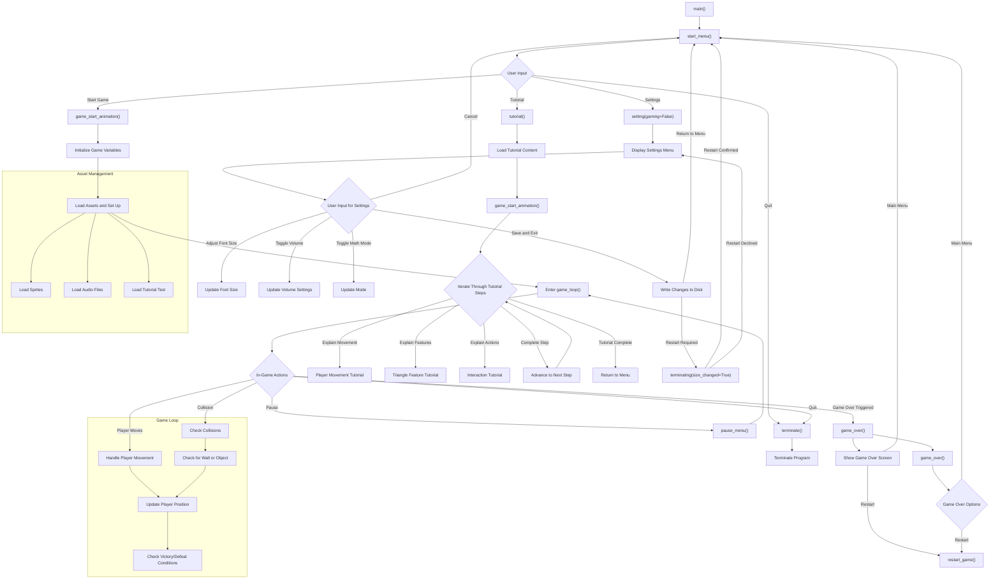

# numeracy




# numeracy

- game
  - theme
    - trigonometry
  - forms of expression
    - visual elements
      - GUI
        - pixel art
        - black-and-white
        - Chinese character-based
      - animations
    - sound
      - music
      - sound effects
  - mechanics
    - endlessly start a new stage until game end
      - a stage
        - draw a right-angled triangle randomly
          - generate three vertices coordinates randomly
          - connect by lines composed of Chinese characters 勾、股、弦
            - figure out whether the line is minor cathetus, major cathetus or hypotenuse
            - calculate the coordinates of every Chinese character that should be drawn on
        - generate a trigonometric question randomly
          - generate a question randomly
            - generate a trigonometric function randomly
              - set of functions
                - core math
                  - sin
                  - cos
                  - tan
                - extras for Mathematics Extended Part
                  - csc
                  - sec
                  - cot
            - generate an angle of the triangle except the right angle randomly
            - generate the quadrant randomly
            - generate the amount of salt(+360°n) that doesn't affect the ratio randomly
          - find the ratio answer
            - whether th angle is complementary angle
            - look for the numerator and the denominator of the ratio
      - player input
        - keyboard-only
        - solving trigonometric ratio
          - point out the numerator and the denominator of the trigonometric ratio sequentially
      - timing system
        - initial time for every stages that decrease with number of stages done
        - Inherit time remain from last stage
      - scoring system
        - calculate the scores of the every finished stages due to time remain
        - accumulate the score of the whole game
      - settlement
        - time is up
        - wrong answer
        - whenever player decide
  - menu
  - tutorial
  - storage
    - the highest score
    - settings
      - font size
      - whether is under Mathematics Extended Part mode
      - whether the sound is on


$$y=2+\sum_{n=0}^{x}n$$


$$y=\frac{d}{2+\sum_{n=0}^{x}n}$$


$$y=\sum_{m=0}^{x}\frac{d}{2+\sum_{n=0}^{m}n}$$


$$0\le x\le\frac{d}{3}\cdot2$$


## mindmap


## folder structure

```
numeracy
├── readme.md
├── numeracy.py
├── module.py
├── setup.py
├── assets
│   ├── Cubic_11_1.300_R.ttf
│   ├── levelup.mp3
│   ├── lever_0.mp3
│   ├── lever_1.mp3
│   ├── minecraft_click.mp3
│   ├── toby fox - UNDERTALE Soundtrack - 10 Ghost Fight.flac
│   ├── toby fox - UNDERTALE Soundtrack - 11 Determination.flac
│   ├── tutorial.txt
│   ├── typing.mp3
│   ├── 房.png
│   ├── 數感.png
│   ├── 早.flac
│   ├── 鎖門.mov
│   ├── 開門.mov
│   └── 間.png
├── icon.ico
├── splash.png
```

which is generated by `tree` command after `cd` to the target directory  


## imported modules


### built-ins


##### `import sys`  

> for getting temp paths of assets files created by the [bundled executable](#executable-bundling) and exit the game


##### `import os`  

> for handling file paths with compatibility among different os, checking whether file is exist and accessing to os environmental variables


##### `import random`  

> for generating questions


##### `import operator`  

> for manipulating addition and subtraction by implicit conversion from bool to index


### external packages


##### `import pygame`  

> the core of the whole program


##### `from pygame.locals import *`  

> to shorten the code when referring to constants in pygame


##### `import cv2`  

> for processing videos as the `pygame.movie` module is deprecated and no longer supported


##### `from PIL import Image`  

> for lossless magnification of images


---

for your own reference, the environment could be setup by:

```shell
pip install pygame-ce
pip install opencv-python
pip install pillow
```


## used built-ins

[*reference*][python_built-ins]


### classes


##### *class* `super(type, object_or_type=None)`

> Return a proxy object that delegates method calls to a parent or sibling class of type. This is useful for accessing inherited methods that have been overridden in a class.
> 
> The *object_or_type* determines the method resolution order to be searched. The search starts from the class right after the type.
> 
> For example, if \_\_mro__ of *object_or_type* is `D -> B -> C -> A -> object` and the value of *type* is `B`, then [super()](#class-supertype-object_or_typenone) searches `C -> A -> object`.
> 
> The \_\_mro__ attribute of the class corresponding to *object_or_type* lists the method resolution search order used by both getattr() and [super()](#class-supertype-object_or_typenone). The attribute is dynamic and can change whenever the inheritance hierarchy is updated.
> 
> If the second argument is omitted, the super object returned is unbound. If the second argument is an object, `isinstance(obj, type)` must be true. If the second argument is a type, `issubclass(type2, type)` must be true (this is useful for classmethods).
> 
> When called directly within an ordinary method of a class, both arguments may be omitted (“zero-argument **super()**”). In this case, *type* will be the enclosing class, and *obj* will be the first argument of the immediately enclosing function (typically `self`). (This means that zero-argument **super()** will not work as expected within nested functions, including generator expressions, which implicitly create nested functions.)
> 
> There are two typical use cases for *super*. In a class hierarchy with single inheritance, *super* can be used to refer to parent classes without naming them explicitly, thus making the code more maintainable. This use closely parallels the use of *super* in other programming languages.
> 
> The second use case is to support cooperative multiple inheritance in a dynamic execution environment. This use case is unique to Python and is not found in statically compiled languages or languages that only support single inheritance. This makes it possible to implement “diamond diagrams” where multiple base classes implement the same method. Good design dictates that such implementations have the same calling signature in every case (because the order of calls is determined at runtime, because that order adapts to changes in the class hierarchy, and because that order can include sibling classes that are unknown prior to runtime).
> 
> For both use cases, a typical superclass call looks like this:
> 
> ```python
> class C(B):
>     def method(self, arg):
>         super().method(arg)    # This does the same thing as:
>                                # super(C, self).method(arg)
> ```
> 
> In addition to method lookups, [super()](#class-supertype-object_or_typenone) also works for attribute lookups. One possible use case for this is calling descriptors in a parent or sibling class.
> 
> Note that [super()](#class-supertype-object_or_typenone) is implemented as part of the binding process for explicit dotted attribute lookups such as `super().__getitem__(name)`. It does so by implementing its own __getattribute__() method for searching classes in a predictable order that supports cooperative multiple inheritance. Accordingly, [super()](#class-supertype-object_or_typenone) is undefined for implicit lookups using statements or operators such as `super()[name]`.
> 
> Also note that, aside from the zero argument form, [super()](#class-supertype-object_or_typenone) is not limited to use inside methods. The two argument form specifies the arguments exactly and makes the appropriate references. The zero argument form only works inside a class definition, as the compiler fills in the necessary details to correctly retrieve the class being defined, as well as accessing the current instance for ordinary methods.


##### *class* `class set([iterable])`

> Return a new set object whose elements are taken from *iterable*. The elements of a set must be hashable. To represent sets of sets, the inner sets must be frozenset objects. If *iterable* is not specified, a new empty set is returned.
> 
> A *set* object is an unordered collection of distinct hashable objects. Common uses include membership testing, removing duplicates from a sequence, and computing mathematical operations such as intersection, union, difference, and symmetric difference. (For other containers see the built-in dict, list, and tuple classes, and the collections module.)
> 
> Like other collections, sets support `x in set`, `len(set)`, and `for x in set`. Being an unordered collection, sets do not record element position or order of insertion. Accordingly, sets do not support indexing, slicing, or other sequence-like behavior.
> 
> The *set* type is mutable — the contents can be changed using methods like add() and remove(). Since it is mutable, it has no hash value and cannot be used as either a dictionary key or as an element of another set.
> 
> Sets can be created by several means:
> 
> - Use a comma-separated list of elements within braces: `{'jack', 'sjoerd'}`
> - Use a set comprehension: `{c for c in 'abracadabra' if c not in 'abc'}`
> - Use the type constructor: `set()`, `set('foobar')`, `set(['a', 'b', 'foo'])`
> 
> Here are some operations provided by instances of set where are used in the project:
> 
>> `intersection(*others) `  
>> `set & other & ...`
>>> Return a new set with elements from the set and all others
>
>> `symmetric_difference(other)`  
>> `set ^ other`
>>> Return a new set with elements in either the set or other but not both.


### functions


##### `globals()`

> Return the dictionary implementing the current module namespace. For code within functions, this is set when the function is defined and remains the same regardless of where the function is called.

---


#### operator


##### `operator.add(a, b)`

> Return `a + b`, for *a* and *b* numbers.


##### `operator.sub(a, b)`

> Return a - b.


#### random


##### `random.choices(population, weights=None, *, cum_weights=None, k=1)`

> Return a *k* sized list of elements chosen from the *population* with replacement. If the *population* is empty, raises [**IndexError**](#exception-indexerror).
> 
> If a *weights* sequence is specified, selections are made according to the relative weights. Alternatively, if a *cum_weights* sequence is given, the selections are made according to the cumulative weights (perhaps computed using `itertools.accumulate()`). For example, the relative weights `[10, 5, 30, 5]` are equivalent to the cumulative weights `[10, 15, 45, 50]`. Internally, the relative weights are converted to cumulative weights before making selections, so supplying the cumulative weights saves work.
> 
> If neither *weights* nor *cum_weights* are specified, selections are made with equal probability. If a weights sequence is supplied, it must be the same length as the *population* sequence. It is a **TypeError** to specify both *weights* and *cum_weights*.
> 
> The *weights* or *cum_weights* can use any numeric type that interoperates with the float values returned by `random()` (that includes integers, floats, and fractions but excludes decimals). Weights are assumed to be non-negative and finite. A [**ValueError**](#exception-valueerror) is raised if all weights are zero.
> 
> For a given seed, the `choices()` function with equal weighting typically produces a different sequence than repeated calls to `choice()`. The algorithm used by `choices()` uses floating-point arithmetic for internal consistency and speed. The algorithm used by `choice()` defaults to integer arithmetic with repeated selections to avoid small biases from round-off error.


##### `random.sample(population, k, *, counts=None)`

> Return a *k* length list of unique elements chosen from the population sequence. Used for random sampling without replacement.
> 
> Returns a new list containing elements from the population while leaving the original population unchanged. The resulting list is in selection order so that all sub-slices will also be valid random samples. This allows raffle winners (the sample) to be partitioned into grand prize and second place winners (the subslices).
> 
> Members of the population need not be hashable or unique. If the population contains repeats, then each occurrence is a possible selection in the sample.
> 
> Repeated elements can be specified one at a time or with the optional keyword-only counts parameter. For example, `sample(['red', 'blue'], counts=[4, 2], k=5)` is equivalent to `sample(['red', 'red', 'red', 'red', 'blue', 'blue'], k=5)`.
> 
> To choose a sample from a range of integers, use a `range()` object as an argument. This is especially fast and space efficient for sampling from a large population: `sample(range(10000000), k=60)`.
> 
> If the sample size is larger than the population size, a **ValueError** is raised.


#### os


##### `os.path.abspath(path)`

> Return a normalized absolutized version of the pathname *path*. On most platforms, this is equivalent to calling the function `normpath()` as follows: `normpath(join(os.getcwd(), path))`.


##### `os.path.normpath(path)`

> Normalize a pathname by collapsing redundant separators and up-level references so that `A//B`, `A/B/`, `A/./B` and `A/foo/../B` all become `A/B`. This string manipulation may change the meaning of a path that contains symbolic links. On Windows, it converts forward slashes to backward slashes. To normalize case, use normcase().


##### `os.path.join(path, *paths)`

> Join one or more path segments intelligently. The return value is the concatenation of *path* and all members of **paths*, with exactly one directory separator following each non-empty part, except the last. That is, the result will only end in a separator if the last part is either empty or ends in a separator. If a segment is an absolute path (which on Windows requires both a drive and a root), then all previous segments are ignored and joining continues from the absolute path segment.
> 
> On Windows, the drive is not reset when a rooted path segment (e.g., `r'\foo'`) is encountered. If a segment is on a different drive or is an absolute path, all previous segments are ignored and the drive is reset. Note that since there is a current directory for each drive, `os.path.join("c:", "foo")` represents a path relative to the current directory on drive `C:` (`c:foo`), not `c:\foo`.


### methods


#### str


##### *static* `str.maketrans(x[, y[, z]])`

> This static method returns a translation table usable for [`str.translate()`](#strtranslatetable).
> 
> If there is only one argument, it must be a dictionary mapping Unicode ordinals (integers) or characters (strings of length 1) to Unicode ordinals, strings (of arbitrary lengths) or `None`. Character keys will then be converted to ordinals.
> 
> If there are two arguments, they must be strings of equal length, and in the resulting dictionary, each character in x will be mapped to the character at the same position in y. If there is a third argument, it must be a string, whose characters will be mapped to `None` in the result.


##### `str.translate(table)`

> Return a copy of the string in which each character has been mapped through the given translation table. The table must be an object that implements indexing via \_\_getitem__(), typically a mapping or sequence. When indexed by a Unicode ordinal (an integer), the table object can do any of the following: return a Unicode ordinal or a string, to map the character to one or more other characters; return `None`, to delete the character from the return string; or raise a LookupError exception, to map the character to itself.
> 
> You can use [`str.maketrans()`](#static-strmaketransx-y-z) to create a translation map from character-to-character mappings in different formats.


### exceptions


##### *exception* `ImportError`

> Raised when the import statement has troubles trying to load a module. Also raised when the “from list” in `from ... import` has a name that cannot be found.
> 
> The optional *name* and *path* keyword-only arguments set the corresponding attributes:
> 
> **name**  
>> The name of the module that was attempted to be imported.
> 
> **path**  
>> The path to any file which triggered the exception.


##### *exception* `AttributeError`

> Raised when an attribute reference or assignment fails. (When an object does not support attribute references or attribute assignments at all, TypeError is raised.)
> 
> The name and obj attributes can be set using keyword-only arguments to the constructor. When set they represent the name of the attribute that was attempted to be accessed and the object that was accessed for said attribute, respectively.


##### *exception* `IndexError`

> Raised when a sequence subscript is out of range. (Slice indices are silently truncated to fall in the allowed range; if an index is not an integer, TypeError is raised.)


##### *exception* `ValueError`

> Raised when an operation or function receives an argument that has the right type but an inappropriate value, and the situation is not described by a more precise exception such as IndexError.


##### *exception* `FileNotFoundError`

> Raised when a file or directory is requested but doesn't exist. Corresponds to errno ENOENT.


##### *exception* `NameError`

> Raised when a local or global name is not found. This applies only to unqualified names. The associated value is an error message that includes the name that could not be found.
> 
> The name attribute can be set using a keyword-only argument to the constructor. When set it represent the name of the variable that was attempted to be accessed.


### environment variables


##### `os.environ`

> A mapping object where keys and values are strings that represent the process environment. For example, `environ['HOME']` is the pathname of your home directory (on some platforms), and is equivalent to `getenv("HOME")` in C.
> 
> This mapping is captured the first time the os module is imported, typically during Python startup as part of processing `site.py`. Changes to the environment made after this time are not reflected in [`os.environ`](#osenviron), except for changes made by modifying [`os.environ`](#osenviron) directly.
> 
> This mapping may be used to modify the environment as well as query the environment. putenv() will be called automatically when the mapping is modified.
> 
> On Unix, keys and values use sys.getfilesystemencoding() and `'surrogateescape'` error handler. Use environb if you would like to use a different encoding.
> 
> On Windows, the keys are converted to uppercase. This also applies when getting, setting, or deleting an item. For example, `environ['monty'] = 'python'` maps the key `'MONTY'` to the value `'python'`.
> 
> You can delete items in this mapping to unset environment variables. unsetenv() will be called automatically when an item is deleted from [`os.environ`](#osenviron), and when one of the pop() or clear() methods is called.


## pygame

[*reference*][pygame_ref]


### pygame

***the top level pygame package***


#### functions


##### `pygame.init() -> (numpass, numfail)`

> ***initialize all imported pygame modules***
> 
> Initialize all imported pygame modules. No exceptions will be raised if a module fails, but the total number if successful and failed inits will be returned as a tuple. You can always initialize individual modules manually, but pygame.init()initialize all imported pygame modules is a convenient way to get everything started. The `init()` functions for individual modules will raise exceptions when they fail.
> 
> You may want to initialize the different modules separately to speed up your program or to not use modules your game does not require.
> 
> It is safe to call this `init()` more than once as repeated calls will have no effect. This is true even if you have `pygame.quit()` all the modules.


### pygame.font

***pygame module for loading and rendering fonts***


##### `pygame.font.Font(file_path=None, size=12) -> Font`

> ***create a new Font object from a file***


#### methods


##### `pygame.font.Font.render(text, antialias, color, background=None) -> Surface`

> ***draw text on a new Surface***
> 
> This creates a new Surface with the specified text rendered on it. pygame.font provides no way to directly draw text on an existing Surface: instead you must use Font.render() to create an image (Surface) of the text, then blit this image onto another Surface.
> 
> The text can only be a single line: newline characters are not rendered. Null characters ('x00') raise a TypeError. Both Unicode and char (byte) strings are accepted. For Unicode strings only UCS-2 characters ('\u0001' to '\uFFFF') were previously supported and any greater Unicode codepoint would raise a UnicodeError. Now, characters in the UCS-4 range are supported. For char strings a LATIN1 encoding is assumed. The antialias argument is a boolean: if True the characters will have smooth edges. The color argument is the color of the text [e.g.: (0,0,255) for blue]. The optional background argument is a color to use for the text background. If no background is passed the area outside the text will be transparent.
> 
> The Surface returned will be of the dimensions required to hold the text. (the same as those returned by Font.size()). If an empty string is passed for the text, a blank surface will be returned that is zero pixel wide and the height of the font.
> 
> Depending on the type of background and antialiasing used, this returns different types of Surfaces. For performance reasons, it is good to know what type of image will be used. If antialiasing is not used, the return image will always be an 8-bit image with a two-color palette. If the background is transparent a colorkey will be set. Antialiased images are rendered to 24-bit RGB images. If the background is transparent a pixel alpha will be included.
> 
> Optimization: if you know that the final destination for the text (on the screen) will always have a solid background, and the text is antialiased, you can improve performance by specifying the background color. This will cause the resulting image to maintain transparency information by colorkey rather than (much less efficient) alpha values.
> 
> If you render '\n' an unknown char will be rendered. Usually a rectangle. Instead, you need to handle newlines yourself.
> 
> Font rendering is not thread safe: only a single thread can render text at any time.


### pygame.Surface

***pygame object for representing images***


##### `pygame.Surface((width, height), flags=0, Surface) -> Surface`


#### methods


##### `pygame.Surface.blit(source, dest, area=None, special_flags=0) -> Rect`

> ***draw one image onto another***
> 
> Draws a source Surface onto this Surface. The draw can be positioned with the dest argument. The dest argument can either be a pair of coordinates representing the position of the upper left corner of the blit or a Rect, where the upper left corner of the rectangle will be used as the position for the blit. The size of the destination rectangle does not affect the blit.
> 
> The return rectangle is the area of the affected pixels, excluding any pixels outside the destination Surface, or outside the clipping area.
> 
> Pixel alphas will be ignored when blitting to an 8 bit Surface.
> 
> For a surface with colorkey or blanket alpha, a blit to self may give slightly different colors than a non self-blit.


### pygame.Rect

***pygame object for storing rectangular coordinates***


##### `pygame.Rect((left, top), (width, height)) -> Rect`


#### methods


##### `pygame.Rect.copy() -> Rect`

> ***copy the rectangle***
> 
> Returns a new rectangle having the same position and size as the original.


##### `pygame.Rect.move(x, y) -> Rect`

> ***moves the rectangle***
> 
> Returns a new rectangle that is moved by the given offset. The *x* and *y* arguments can be any integer value, positive or negative.


##### `pygame.Rect.collidelist(list) -> index`

> ***test if one rectangle in a list intersects***
> 
> Test whether the rectangle collides with any in a sequence of rectangles. The index of the first collision found is returned. If no collisions are found an index of `-1` is returned.


### pygame.display

***pygame module to control the display window and screen***


#### functions


##### `pygame.display.Info() -> VideoInfo`

> ***Create a video display information object***
> 
> Creates a simple object containing several attributes to describe the current graphics environment. If this is called before `pygame.display.set_mode()` some platforms can provide information about the default display mode. This can also be called after setting the display mode to verify specific display options were satisfied. The VidInfo object has an attribute with usage in this project:
> 
> **current_h, current_w** 
>> Height and width of the current video mode, or of the desktop mode if called before the display.set_mode is called. (current_h, current_w are available since SDL 1.2.10, and pygame 1.8.0). They are -1 on error, or if an old SDL is being used.


##### `pygame.display.get_caption() -> (title, icontitle)`

> ***Get the current window caption***
> 
> This will change the video display color palette for 8-bit displays. This does not change the palette for the actual display Surface, only the palette that is used to display the Surface. If no palette argument is passed, the system default palette will be restored. The palette is a sequence of *RGB* triplets.


### pygame.mouse

***pygame module to work with the mouse***


#### functions


##### `pygame.mouse.set_visible(bool) -> bool`

> ***hide or show the mouse cursor***
> 
> If the bool argument is true, the mouse cursor will be visible. This will return the previous visible state of the cursor.


### pygame.mixer.music

***pygame module for controlling streamed audio***


#### functions


##### `pygame.mixer.music.load() -> None`

> ***Load a music file for playback***
> 
> This will load a music filename/file object and prepare it for playback. If a music stream is already playing it will be stopped. This does not start the music playing.


##### `pygame.mixer.music.play(loops=0, start=0.0, fade_ms=0) -> None`

> ***Start the playback of the music stream***
> 
> This will play the loaded music stream. If the music is already playing it will be restarted.
> 
> *loops* is an optional integer argument, which is `0` by default, which indicates how many times to repeat the music. The music repeats indefinitely if this argument is set to `-1`.
> 
> *start* is an optional float argument, which is `0.0` by default, which denotes the position in time from which the music starts playing. The starting position depends on the format of the music played. *MP3* and *OGG* use the position as time in seconds. For *MP3* files the start time position selected may not be accurate as things like variable bit rate encoding and ID3 tags can throw off the timing calculations. For *MOD* music it is the pattern order number. Passing a start position will raise a NotImplementedError if the start position cannot be set.
> 
> *fade_ms* is an optional integer argument, which is `0` by default, which denotes the period of time (in milliseconds) over which the music will fade up from volume level `0.0` to full volume (or the volume level previously set by `set_volume()`). The sample may end before the fade-in is complete. If the music is already streaming *fade_ms* is ignored.


##### `pygame.mixer.music.pause() -> None`

> ***temporarily stop music playback***
> 
> This will resume the playback of a music stream after it has been paused.


### pygame.mixer

***pygame module for loading and playing sounds***


#### functions


##### `pygame.mixer.pre_init(frequency=44100, size=-16, channels=2, buffer=512, devicename=None, allowedchanges=AUDIO_ALLOW_FREQUENCY_CHANGE | AUDIO_ALLOW_CHANNELS_CHANGE) -> None`

> ***preset the mixer init arguments***
> 
> Call pre_init to change the defaults used when the real `pygame.mixer.init()` is called. Keyword arguments are accepted. The best way to set custom mixer playback values is to call `pygame.mixer.pre_init()` before calling the top level pygame.init(). For backwards compatibility, argument values of `0` are replaced with the startup defaults, except for `allowedchanges`, where `-1` is used.


### pygame.system

***pygame module to provide additional context about the system***


#### functions


##### `pygame.system.get_pref_path(org, app) -> path`

> *get a writeable folder for the app*
> 
> When distributing apps, it's helpful to have a way to get a writeable path, because it's what apps are expected to do, and because sometimes the local space around the app isn't writeable to the app.
> 
> This function returns a platform specific path for your app to store savegames, settings, and the like. This path is unique per user and per app name.
> 
> It takes two strings, *org* and *app*, referring to the "organization" and "application name." For example, the organization could be "Valve," and the application name could be "Half Life 2." It then will figure out the preferred path, **creating the folders referenced by the path if necessary**, and return a string containing the absolute path.
> 
> For example:
>
>> On Windows, it would resemble  
>> C:\\Users\\bob\\AppData\\Roaming\\My Company\\My Program Name\\
>>
>> On macOS, it would resemble  
/Users/bob/Library/Application Support/My Company/My Program Name/
>>
>> And on Linux it would resemble  
>> /home/bob/.local/share/My Company/My Program Name/


## self-defined


### constants


##### `ADD_SUB = (operator.add, operator.sub)`

> ***implicit casting from bool to index to determine whether operating addition or subtraction***
>
> usage:  
> `ADD_SUB[0](a, b) == a + b`, where `ADD_SUB[1](a, b) == a - b`


##### `HEIGHT = pygame.display.Info().current_h * 3 // 4`

> ***height of the game screen, which is around 75% of the current monitor height***


##### `WIDTH = HEIGHT // 10 * 16`

> ***width of the game screen, where the aspect ratio of screen is 16:10***


##### translation maps


> ##### `NUM_TRANS = str.maketrans('0123456789', '０１２３４５６７８９')`
> 
> ##### `MARK_TRANS = str.maketrans('ABC', 'ＡＢＣ') # for translation of alphabets from halfwidth to fullwidth`
> 
> 
>> ***a translation map of numbers or alphabets from halfwidth to fullwidth***
>> 
>> they as the argument passed into [`str.translate()`](#strtranslatetable)


##### `PATH = pygame.system.get_pref_path('still_thinking', 'numeracy')`

> ***get a writeable folder for storing game data***
> 
> with reference to [`pygame.system.get_pref_path()`](#path--pygamesystemget_pref_pathstill_thinking-numeracy):
> 
>> On Windows, it would resemble  
>> C:\\Users\\bob\\AppData\\Roaming\\still_thinking\\numeracy\\
>>
>> On macOS, it would resemble  
/Users/bob/Library/Application Support/still_thinking/numeracy/
>>
>> And on Linux it would resemble  
>> /home/bob/.local/share/still_thinking/numeracy/


### global variables


##### `volume`

> ***an integer implicit casting to boolean as expressions in usage to determine whether sound is on***
> 
> it should be either `0` or `1`


##### `last_music`

> ***a string of the music file name played last time***


##### `font`

> ***a [Font](#pygamefont) object of [Cubic-11][cubic-11]W with font size [`font_size`](#font_size)***


##### `font_size`

> ***an integer of font size***


##### `do4`

> ***a Tuple stores a quarter of the game window dimension where are floored to the multiples of [the dimension of a Chinese character](#font_rect)***


##### `font_rect`

> ***a [Rect](#pygamerect) where the size attribute storing the dimension a Chinese character under current [font size](#font_size)***


##### `clock`

> ******


##### `player`

> ******


##### `mode`

> ***a Boolean shows whether the game is under Mathematics Extended Part mode***


##### `mode_mark`

> ***a [Surface](#pygamesurface) of the Chinese characters `'延伸'` which is enlarged to 2x of the [standard one](#font_rect)***

##### `mode_mark_rect`

> ***a [Rect](#pygamerect) of [`mode_mark`](#mode_mark)***

##### last_move

> ***a list stores the sequence of key presses that the player is currently holding***

##### `last_music`

> ***a String stores the file name of current-playing music***

##### `all_group`

> 


### classes


##### *class* `Player(*group: tuple[pygame.sprite.Group, ...] | pygame.sprite.Group)`

> the character that player controls
> 
> ```python
> class Player(pygame.sprite.Sprite):
>     """character that player control"""
> 
>     def __init__(self, *group: tuple[pygame.sprite.Group, ...] | pygame.sprite.Group):
>         super().__init__(*group) # adding sprites to sprite groups
>         self.image = render_font('我')
>         self.rect = self.image.get_rect(topleft=(do4[0] / 2 // font_rect.w * font_rect.w, do4[1] * 2 - font_rect.h))
>         self.prev_rect = self.rect
>         self.move = [0, 0] # the direction player have to move
>         self.last_move = pygame.time.get_ticks()
>         self.status = True
> 
>     def update(self, *args, **kwargs):
>         self.status = True
>         if pygame.time.get_ticks() - self.last_move > 15 * (2 - bool(pygame.key.get_mods() & KMOD_SHIFT)):
>             self.last_move = pygame.time.get_ticks()
>             self.prev_rect = self.rect.copy()
>             self.rect.x += self.move[0] * font_rect.w
>             self.rect.y += self.move[1] * font_rect.h
>             for sprite_group in line_groups.values():  # to stop player movement if obstacle exists
>                 if pygame.sprite.spritecollideany(self, sprite_group) is not None:
>                     self.rect = self.prev_rect
> ```
> 
> [`super().__init__(*group)`](#class-supertype-object_or_typenone) add the Player instance to sprite groups `*group`

### functions


##### `get_path(relative_path: str) -> str`

> ***return files' absolute path***
> 
> return path to the temporary folder created for bundled asset files in the [bundled executable](#executable-bundling), otherwise, return file absolute path
> 
> ```python
> def get_path(relative_path: str) -> str:
>     """return file's absolute path"""
>     try:
>         base_path = sys._MEIPASS
>     except AttributeError:
>         base_path = os.path.abspath('.')
> 
>     return os.path.normpath(os.path.join(base_path, relative_path))
> ```
> 
> where:
> 
> as [`sys._MEIPASS`](#sys_meipass) is only created by the [bundled executable](#executable-bundling), [`except AttributeError:`](#exception-attributeerror) handles the direct execution by interpreter
> 
> [`os.path.abspath('.')`](#ospathabspathpath) return the absolute path of current directory
> 
> [`os.path.normpath()`](#ospathnormpathpath) normalize the path joined by [`os.path.join(base_path, relative_path)`](#ospathjoinpath-paths)


##### `music_play(music: str) -> None`

> ***play music whether sound setting is on, otherwise, only load the music***
> 
> ```python
> def music_play(music: str) -> None:
>     global last_music
>     if last_music != music:
>         last_music = music
>         pygame.mixer.music.load(get_path('assets' + os.path.sep + music))
>         pygame.mixer.music.play(-1, fade_ms=3000)
>         if not volume:
>             pygame.mixer.music.pause()
> ```
> 
> where:
> 
> `if last_music != music:` ensure the music continuity as the route from [`opening()`](#opening---none) to [`menu(False)`](#menugaming-bool--int---bool) may replay `早.flac`
> 
> [`get_path('assets' + os.path.sep + music)`](#get_pathrelative_path-str---str) as the argument of [`pygame.mixer.music.load()`](#pygamemixermusicload---none) load the *music*, where [`pygame.mixer.music.play(-1, fade_ms=3000)`](#music_playmusic-str---none) fade in the *music* in 3 seconds and then repeat it indefinitely
> 
> as [`if not volume:`](#volume), which means the sound setting is off, [pause](#pygamemixermusicpause---none) the music immediately, results in only load the *music* but not playing it


##### `se_play(se: str) -> None`

> ***play sound effect(se) whether sound setting is on***
> 
> ```python
> if volume:
>     pygame.mixer.Sound(get_path('assets' + os.path.sep + se)).play()
> ```
> 
> where:
> 
> *se* pass the filename of sound effects which store in the `assets` folder, for example, `'早.flac'`.


##### `render_font(word: str, scale: int | float = 1) -> pygame.Surface`

> ***render word with a scale of magnification if any***
> 
> ```python
> return pygame.transform.scale_by(font.render(word, True, (255, 255, 255), (0, 0, 0)), scale)
> ```
> 
> where:
> 
> [`font.render(word, True, (255, 255, 255), (0, 0, 0))`](#pygamefontfontrendertext-antialias-color-backgroundnone---surface) render antialiased *word* in white where specifying the background color in black to optimize the performance
> 
> then the rendered [Surface](#pygamesurface) is passed into [`pygame.transform.scale_by()`]() to enlarge with *scale*


##### `mode_declare() -> None`

> ***[blit](#pygamesurfaceblitsource-dest-areanone-special_flags0---rect) [`mode_mark`](#mode_mark) in the bottom-right corner of the game screen whether [`mode`](#mode) is `True`***
> 
> ```python
>     if mode:
>         screen.blit(mode_mark, mode_mark_rect.topleft)
> ```


##### `opening() -> None`


##### `menu(gaming: bool | int) -> bool`


##### `main() -> None`

##### `question(difficulty: int) -> tuple[tuple[str, str], str]`


##### `triangle(last_words: list[str] | None = None) -> tuple[tuple[tuple[int, int], tuple[int, int], tuple[int, int]], list[str]]`


##### `setting(gaming: bool | int) -> bool | None`

the interface of the pages remained unchanged until be mentioned any change. 


##### during opening animation

...music `'早.flac'` played...OK  

press *Z*...no response...OK  
-> press *control*/*command*...no response...OK  
-> hold *Z* and then press *ctrl*/*cmd*...no response...OK  
-> hold *ctrl*/*cmd* and then press *Z*...no response...OK  
-> press *space*/*return*/*enter*...no response...OK  
-> press *A*/*left*...no response...OK  
-> press *D*/*right*...no response...OK  
-> press *W*/*up*...no response...OK  
-> press *S*/*down*...no response...OK  
-> press *esc*...`'lever_1.mp3'` had played, entered *terminating* page...OK  
-> press *esc*...`'lever_0.mp3'` had played, backed to the *opening* animation resumed at the same progress as left...OK  
-> hold *esc*...`'lever_1.mp3'` had played, entered *terminating* page and then stopped...OK  
-> press *esc*...`'lever_0.mp3'` had played, backed to the *opening* animation resumed at the same progress as left...OK  
-> press *F11*...entered full-screen mode...OK  
-> press *F11*...left full-screen mode...OK  
-> press *esc*...`'lever_1.mp3'` had played, entered *terminating* page...OK  


##### during terminating page

-> press *F11*...entered full-screen mode...OK  
-> press *F11*...left full-screen mode...OK  
-> press *Z*...no response...OK  
-> press *control*/*command*...no response...OK  
-> hold *Z* and then press *ctrl*/*cmd*...no response...OK  
-> hold *ctrl*/*cmd* and then press *Z*...no response...OK  
-> press *A*/*left*...no response...OK  
-> press *D*/*right*...no response...OK  
-> press *W*/*up*...no response...OK  
-> press *S*/*down*...`'lever_1.mp3'` had played, the Chinese character `'我'` moved down by one unit...OK  
-> press *S*/*down*...no response...OK  
-> press *W*/*up*...`'lever_0.mp3'` had played, the Chinese character `'我'` moved up by one unit...OK  

...exceeded more than ten seconds since entered the page.  

---

for macOS:  
a sentence `'方向鍵切換選擇　　　return/空白鍵選中　　　ESC回到目錄　　　Ｆ１１進入全屏幕'` appeared in the bottom-left corner of the *program* window with breathing effect...OK  

---

for Windows:  
a sentence `'方向鍵切換選擇　　　enter/空白鍵選中　　　ESC回到目錄　　　Ｆ１１進入全屏幕'` appeared in the bottom-left corner of the *program* window with breathing effect...OK  

---

-> press *space*/*return*/*enter*...`'minecraft_click.mp3'` had played, backed to the *opening* animation resumed at the same progress as left while the bottom-left-corner line had gone...OK  
-> press *esc*...`'lever_1.mp3'` had played, entered *terminating* page...OK  
-> press *S*/*down*...`'lever_1.mp3'` had played, the Chinese character `'我'` moved down by one unit...OK  
-> press *space*/*return*/*enter*...`'minecraft_click.mp3'` had played, *terminate* `'確定要退出嗎？'` message box popped up where default choice `'取消'`...OK  
-> press *return*/*enter*...backed to the *terminating* page where the Chinese character `'我'` remained next to the line `'離開遊戲'`...OK  
-> press *space*/*return*/*enter*...`'minecraft_click.mp3'` had played, *terminate* `'確定要退出嗎？'` message box popped up where default choice `'取消'`...OK  
-> press *A*/*left*...no response...OK  

---

for Windows:  
-> press *D*/*right*...choice changed to `'繼續'`...OK  
-> press *D*/*right*...no response...OK  
-> press *return*/*enter*...*program* exited...OK  

---

for macOS:  
-> press *D*/*right*...no response...OK  
-> press *D*/*right*...no response...OK  
-> press *return*/*enter*...*program* exited...OK  
-> press *return*/*enter*...backed to the *terminating* page where the Chinese character `'我'` remained next to the line `'離開遊戲'`...OK
-> press *esc*...`'lever_1.mp3'` had played, entered *terminating* page...OK  
-> left click mouse on `'繼續'`...*program* exited...OK  

---

...restarted the *program*...OK  
...the title `'數感'` faded in and then moved up...OK  
...Chinese characters showed typing effect in an uneven rate while sound effect `'typing.mp3'` played at every character had been typed...OK  
...the Chinese character `'我'` settled next to the line `'開始冒險'`...OK  
...*opening* animation ended. entered *menu* page...OK  


##### during menu page

-> press *Z*...no response...OK  
-> press *control*/*command*...no response...OK  
-> hold *Z* and then press *ctrl*/*cmd*...no response...OK  
-> hold *ctrl*/*cmd* and then press *Z*...no response...OK  
-> press *W*/*up*...no response...OK  
-> press *S*/*down*...no response...OK  
-> press *F11*...entered full-screen mode...OK  
-> press *F11*...left full-screen mode...OK  
-> press *esc*...`'lever_1.mp3'` had played, entered *terminating* page...OK  
-> press *esc*...`'lever_0.mp3'` had played, backed to the *menu* page where the Chinese character `'我'` remained next to the line `'開始冒險'`...OK  
-> hold *esc*...`'lever_1.mp3'` had played, entered *terminating* page and then stopped...OK  
-> press *esc*...`'lever_0.mp3'` had played, backed to the *menu* page where the Chinese character `'我'` remained next to the line `'開始冒險'`...OK  
-> press *A*/*left*...`'lever_1.mp3'` had played, the Chinese character `'我'` moved left by one unit...OK  
-> press *A*/*left*...no response...OK  
-> press *esc*...`'lever_1.mp3'` had played, entered *terminating* page...OK  
-> press *esc*...`'lever_0.mp3'` had played, backed to the *menu* page where the Chinese character `'我'` remained next to the line `'開始教學'`...OK  
-> hold *esc*...`'lever_1.mp3'` had played, entered *terminating* page and then stopped...OK  
-> press *esc*...`'lever_0.mp3'` had played, backed to the *menu* page where the Chinese character `'我'` remained next to the line `'開始教學'`...OK  
-> press *D*/*right*...`'lever_0.mp3'` had played, the Chinese character `'我'` moved right by one unit...OK  
-> press *D*/*right*...`'lever_0.mp3'` had played, the Chinese character `'我'` moved right by one unit...OK  
-> press *D*/*right*...no response...OK  
-> hold *A*/*left*...`'lever_1.mp3'` had played, the Chinese character `'我'` moved left by one unit and then stopped...OK  
-> press *A*/*left*...`'lever_1.mp3'` had played, the Chinese character `'我'` moved left by one unit...OK  
-> hold *D*/*right*...`'lever_0.mp3'` had played, the Chinese character `'我'` moved right by one unit and then stopped...OK  
-> press *D*/*right*...`'lever_0.mp3'` had played, the Chinese character `'我'` moved right by one unit...OK  

...exceeded more than ten seconds since entered the page.  

---

for macOS:  
a sentence `'方向鍵切換選擇　　　return/空白鍵選中　　　ESC回到目錄　　　Ｆ１１進入全屏幕'` appeared in the bottom-left corner of the *program* window with breathing effect...OK  

---

for Windows:  
a sentence `'方向鍵切換選擇　　　enter/空白鍵選中　　　ESC回到目錄　　　Ｆ１１進入全屏幕'` appeared in the bottom-left corner of the *program* window with breathing effect...OK  

---

-> press *esc*...`'lever_1.mp3'` had played, entered *terminating* page...OK  
-> press *esc*...`'lever_0.mp3'` had played, backed to the *menu* page where the Chinese character `'我'` remained next to the line `'調整設定'` and also, the breathing effect of the sentence appeared in the bottom-left corner at the same progress as left...OK  
-> hold *esc*...`'lever_1.mp3'` had played, entered *terminating* page and then stop...OK  
-> press *esc*...`'lever_0.mp3'` had played, backed to the *menu* page where the Chinese character `'我'` remained next to the line `'調整設定'` and also, the breathing effect of the sentence appeared in the bottom-left corner at the same progress as left...OK  
-> press *space*/*return*/*enter*...`'minecraft_click.mp3'` had played, entered *setting* page...OK  


##### during setting page

the Chinese character `'我'` next to the line `'保存並回主畫面'`...OK  

-> press *Z*...no response...OK  
-> press *control*/*command*...no response...OK  
-> hold *Z* and then press *ctrl*/*cmd*...no response...OK  
-> hold *ctrl*/*cmd* and then press *Z*...no response...OK  
-> press *S*/*down*...no response...OK  
-> press *A*/*left*...no response...OK  
-> press *D*/*right*...no response...OK  
-> press *F11*...entered full-screen mode...OK  
-> press *F11*...left full-screen mode...OK  

...exceeded more than ten seconds since entered the page.  

---

for macOS:  
a sentence `'方向鍵切換選擇　　　return/空白鍵修正設定　　　ESC回到目錄　　　Ｆ１１進入全屏幕'` appeared in the bottom-left corner of the *program* window with breathing effect...OK  

---

for Windows:  
a sentence `'方向鍵切換選擇　　　enter/空白鍵修正設定　　　ESC回到目錄　　　Ｆ１１進入全屏幕'` appeared in the bottom-left corner of the *program* window with breathing effect...OK  

---

-> press *esc*...`'lever_0.mp3'` had played, backed to the *menu* page where the Chinese character `'我'` remained next to the line `'調整設定'` while the bottom-left-corner line had gone...OK  
-> press *space*/*return*/*enter*...`'minecraft_click.mp3'` had played, entered *setting* page...OK  
-> press *W*/*up*...`'lever_0.mp3'` had played, the Chinese character `'我'` moved up by one unit...OK  
-> press *space*/*return*/*enter*...`'minecraft_click.mp3'` had played, the Chinese character `'否'` had changed to `'是'`...OK  
-> press *W*/*up*...`'lever_0.mp3'` had played, the Chinese character `'我'` moved up by one unit...OK  
-> press *space*/*return*/*enter*...`'minecraft_click.mp3'` had played, the Chinese character `'開'` had changed to `'關'`...OK  
-> press *W*/*up*...`'lever_0.mp3'` had played, the Chinese character `'我'` moved up by one unit...OK  
-> press *space*/*return*/*enter*...`'minecraft_click.mp3'` had played, the Chinese character `'中'` had changed to `'大'`...OK
-> press *S*/*down*...`'lever_1.mp3'` had played, the Chinese character `'我'` moved down by one unit...OK  
-> press *S*/*down*...`'lever_1.mp3'` had played, the Chinese character `'我'` moved down by one unit...OK  
-> press *S*/*down*...`'lever_1.mp3'` had played, the Chinese character `'我'` moved down by one unit...OK  
-> press *esc*...`'lever_0.mp3'` had played, backed to the *menu* page where the Chinese character `'我'` remained next to the line `'調整設定'`...OK  

...music was still being played, the *menu* page appeared as same as the initial one while the page entered was *menu* as usual indicating no change on font size...OK  

-> press *space*/*return*/*enter*...`'minecraft_click.mp3'` had played, entered *setting* page...OK  

...Chinese characters drawn were `'中'` `'開'` `'否'` from top to bottom...OK  

-> press *esc*...`'lever_0.mp3'` had played, backed to the *menu* page where the Chinese character `'我'` remained next to the line `'調整設定'`...OK  
-> press *space*/*return*/*enter*...`'minecraft_click.mp3'` had played, entered *setting* page...OK  
-> press *W*/*up*...`'lever_0.mp3'` had played, the Chinese character `'我'` moved up by one unit...OK  
-> press *W*/*up*...`'lever_0.mp3'` had played, the Chinese character `'我'` moved up by one unit...OK  
-> press *W*/*up*...`'lever_0.mp3'` had played, the Chinese character `'我'` moved up by one unit...OK  
-> press *W*/*up*...no response...OK  
-> press *S*/*down*...`'lever_1.mp3'` had played, the Chinese character `'我'` moved down by one unit...OK  
-> press *S*/*down*...`'lever_1.mp3'` had played, the Chinese character `'我'` moved down by one unit...OK  
-> press *S*/*down*...`'lever_1.mp3'` had played, the Chinese character `'我'` moved down by one unit...OK  
-> hold *W*/*up*...`'lever_0.mp3'` had played, the Chinese character `'我'` moved up by one unit and then stop for a longer interval, after that, started to move up by two units in a shorter time interval while `'lever_0.mp3'` had replayed twice at the timing of movement and then stopped...OK  
-> hold *S*/*down*...`'lever_1.mp3'` had played, the Chinese character `'我'` moved down by one unit and then stop for a longer interval, after that, started to move down by two units in a shorter time interval while `'lever_1.mp3'` had replayed twice at the timing of movement and then stopped...OK  
-> press *W*/*up*...`'lever_0.mp3'` had played, the Chinese character `'我'` moved up by one unit...OK  

...exceeded more than ten seconds since entered the page.  

---

for macOS:  
a sentence `'方向鍵切換選擇　　　return/空白鍵修正設定　　　ESC回到目錄　　　Ｆ１１進入全屏幕'` appeared in the bottom-left corner of the *program* window with breathing effect...OK  

---

for Windows:  
a sentence `'方向鍵切換選擇　　　enter/空白鍵修正設定　　　ESC回到目錄　　　Ｆ１１進入全屏幕'` appeared in the bottom-left corner of the *program* window with breathing effect...OK  

---

-> press *space*/*return*/*enter*...`'minecraft_click.mp3'` had played, the Chinese character `'否'` had changed to `'是'`...OK  

...the bottom-left-corner line had gone...OK  

-> press *space*/*return*/*enter*...`'minecraft_click.mp3'` had played, the Chinese character `'是'` had changed to `'否'`...OK  
-> hold *space*/*return*/*enter*...`'minecraft_click.mp3'` had played, the Chinese character `'否'` had changed to `'是'` and then stop for a longer interval, after that, started to change between `'否'` and `'是'` in a shorter time interval while `'minecraft_click.mp3'` had replayed everytime at the timing of change until *space*/*return*/*enter* had been released...OK  
...the Chinese character had been settled at `'是'`...OK  
-> press *W*/*up*...`'lever_0.mp3'` had played, the Chinese character `'我'` moved up by one unit...OK  
-> press *space*/*return*/*enter*...`'minecraft_click.mp3'` had played, the Chinese character `'開'` had changed to `'關'`...OK  
-> press *space*/*return*/*enter*...`'minecraft_click.mp3'` had played, the Chinese character `'關'` had changed to `'開'`...OK  
-> hold *space*/*return*/*enter*...`'minecraft_click.mp3'` had played, the Chinese character `'開'` had changed to `'關'` and then stop for a longer interval, after that, started to change between `'開'` and `'關'` in a shorter time interval while `'minecraft_click.mp3'` had replayed everytime at the timing of change until *space*/*return*/*enter* had been released...OK  
...the Chinese character had been settled at `'開'`...OK  
-> press *W*/*up*...`'lever_0.mp3'` had played, the Chinese character `'我'` moved up by one unit...OK  
-> press *space*/*return*/*enter*...`'minecraft_click.mp3'` had played, the Chinese character `'中'` had changed to `'大'`...OK  
-> press *space*/*return*/*enter*...`'minecraft_click.mp3'` had played, the Chinese character `'大'` had changed to `'小'`...OK  
-> press *space*/*return*/*enter*...`'minecraft_click.mp3'` had played, the Chinese character `'小'` had changed to `'中'`...OK  
-> hold *space*/*return*/*enter*...`'minecraft_click.mp3'` had played, the Chinese character `'中'` had changed to `'大'` and then stop for a longer interval, after that, started to change between `'小'`, `'中'` and `'大'` in a shorter time interval while `'minecraft_click.mp3'` had replayed everytime at the timing of change until *space*/*return*/*enter* had been released...OK  
...the Chinese character had been settled at `'中'`...OK  
-> hold *S*/*down*...`'lever_1.mp3'` had played, the Chinese character `'我'` moved down by one unit and then stop for a longer interval, after that, started to move down by two units in a shorter time interval while `'lever_1.mp3'` had replayed twice at the timing of movement and then stopped...OK  
-> press *space*/*return*/*enter*...`'minecraft_click.mp3'` had played, backed to the *menu* page where the Chinese character `'我'` remained next to the line `'調整設定'`...OK  

...music `'早.flac'` paused while the Chinese characters `'延伸'` appeared in the bottom-right corner of the *program* window at once...OK  

-> press *space*/*return*/*enter*...`'minecraft_click.mp3'` had not played, entered *setting* page...OK  

-> press *W*/*up*...the Chinese character `'我'` moved up by one unit...OK  
-> press *space*/*return*/*enter*...the Chinese character `'是'` had changed to `'否'`...OK  
-> press *W*/*up*... the Chinese character `'我'` moved up by one unit...OK  
-> press *W*/*up*...the Chinese character `'我'` moved up by one unit...OK  
-> press *space*/*return*/*enter*...the Chinese character `'中'` had changed to `'大'`...OK  
-> hold *S*/*down*...the Chinese character `'我'` moved down by one unit and then stop for a longer interval, after that, started to move down by two units in a shorter time interval while `'lever_1.mp3'` had replayed twice at the timing of movement and then stopped...OK  
-> press *space*/*return*/*enter*...entered the *restart* page where the Chinese character `'我'` next to the line `'不想重啟'`...OK  

##### during restart page

-> press *F11*...entered full-screen mode...OK  
-> press *F11*...left full-screen mode...OK  
-> press *Z*...no response...OK  
-> press *control*/*command*...no response...OK  
-> hold *Z* and then press *ctrl*/*cmd*...no response...OK  
-> hold *ctrl*/*cmd* and then press *Z*...no response...OK  
-> press *A*/*left*...no response...OK  
-> press *D*/*right*...no response...OK  
-> press *W*/*up*...no response...OK  
-> press *S*/*down*...the Chinese character `'我'` moved down by one unit...OK  
-> press *S*/*down*...no response...OK  
-> press *W*/*up*...the Chinese character `'我'` moved up by one unit...OK  

...exceeded more than ten seconds since entered the page.  

---

for macOS:  
a sentence `'方向鍵切換選擇　　　return/空白鍵選中　　　ESC回到目錄　　　Ｆ１１進入全屏幕'` appeared in the bottom-left corner of the *program* window with breathing effect...OK  

---

for Windows:  
a sentence `'方向鍵切換選擇　　　enter/空白鍵選中　　　ESC回到目錄　　　Ｆ１１進入全屏幕'` appeared in the bottom-left corner of the *program* window with breathing effect...OK  

---

-> press *space*/*return*/*enter*...backed to the *menu* page where the Chinese character `'我'` remained next to the line `'調整設定'` while the bottom-left-corner line had gone...OK  

...the only change was that the Chinese characters `'延伸'` in the bottom-right corner had gone...OK  

-> press *space*/*return*/*enter*...entered *setting* page...OK  

##### during setting page

...Chinese characters drawn were `'大'` `'關'` `'否'` from top to bottom...OK  

-> press *esc*...backed to the *menu* page where the Chinese character `'我'` remained next to the line `'調整設定'`...OK  
-> press *space*/*return*/*enter*...entered *setting* page...OK  
-> press *W*/*up*...`'lever_0.mp3'` had played, the Chinese character `'我'` moved up by one unit...OK  
-> press *space*/*return*/*enter*...`'minecraft_click.mp3'` had played, the Chinese character `'否'` had changed to `'是'`...OK  
-> press *S*/*down*...`'lever_1.mp3'` had played, the Chinese character `'我'` moved down by one unit...OK  
-> press *space*/*return*/*enter*...backed to the *restart* page where the Chinese character `'我'` next to the line `'不想重啟'`...OK  
-> press *S*/*down*...the Chinese character `'我'` moved down by one unit...OK  
-> press *space*/*return*/*enter*...restarted the *program*...OK  

...Chinese characters had enlarged indicating that the font size had increased...OK  
...the Chinese characters `'延伸'` in the bottom-right corner faded in so as the title `'數感'` and then the title `'數感'` moved up...OK  
...Chinese characters showed typing effect in an uneven rate while sound effect `'typing.mp3'` had not played...OK  
...the Chinese character `'我'` settled next to the line `'開始冒險'`...OK  
...the Chinese characters `'延伸'` would stay still in the bottom-right corner of the window for the remainder of the test...OK  
...*opening* animation ended. entered *menu* page...OK  

-> press *D*/*right*...the Chinese character `'我'` moved right by one unit...OK  
-> press *space*/*return*/*enter*...entered *setting* page...OK  
-> press *W*/*up*...the Chinese character `'我'` moved up by one unit...OK  
-> press *W*/*up*...the Chinese character `'我'` moved up by one unit...OK  
-> press *space*/*return*/*enter*...the Chinese character `'關'` had changed to `'開'`...OK  
-> press *S*/*down*...the Chinese character `'我'` moved down by one unit...OK  
-> press *S*/*down*...the Chinese character `'我'` moved down by one unit...OK  
-> press *space*/*return*/*enter*...backed to the *menu* page where the Chinese character `'我'` remained next to the line `'調整設定'`...OK  

...music `'早.flac'` resumed...OK  

-> press *A*/*left*...`'lever_1.mp3'` had played, the Chinese character `'我'` moved left by one unit...OK  
-> press *space*/*return*/*enter*...`'minecraft_click.mp3'` had played, *game start* animation started...OK  

##### during game start animation

...music `'toby fox - UNDERTALE Soundtrack - 10 Ghost Fight.flac'` played...OK  


-> press *space*/*return*/*enter*...no response...OK  
-> press *A*/*left*...no response...OK  
-> press *D*/*right*...no response...OK  
-> press *W*/*up*...no response...OK  
-> press *S*/*down*...no response...OK  
-> press *Z*...no response...OK  
-> press *control*/*command*...no response...OK  
-> hold *Z* and then press *ctrl*/*cmd*...no response...OK  
-> hold *ctrl*/*cmd* and then press *Z*...backed to the *menu* page where the Chinese character `'我'` remained next to the line `'開始冒險'`...OK  
-> press *space*/*return*/*enter*...`'minecraft_click.mp3'` had played, *game start* animation started...OK  
-> press *F11*...entered full-screen mode...OK  
-> press *F11*...left full-screen mode...OK  
-> press *esc*...`'lever_1.mp3'` had played, entered the *in-game menu* page where the Chinese character `'我'` remained next to the line `'繼續冒險'`...OK  

##### during in-game menu

...the Chinese character `'我'` remained next to the line `'繼續冒險'`...OK  

-> press *space*/*return*/*enter*...`'minecraft_click.mp3'` had played, backed to the *game start* animation resumed at the same progress as left ...OK  
-> press *esc*...`'lever_1.mp3'` had played, entered the *in-game menu* page where the Chinese character `'我'` remained next to the line `'繼續冒險'`...OK  
-> press *esc*...`'lever_0.mp3'` had played, backed to the *game start* animation resumed at the same progress as left ...OK  


...the Chinese characters `'房門'` faded in, located at around the left quarter of the screen...OK  
...the Chinese character `'門'` showed an open animation and then faded out...OK  
...the Chinese character `'我'` faded in at the location of the Chinese character `'門'` which had just faded out and then moved down by one unit...OK  
...the Chinese character `'門'` showed a lock animation to transit to the Chinese character `'間'` and then faded out...OK  
...*game start* animation ended. entered *game stage* page...OK  


## executable bundling


##### `import pyi_splash`

> ```python
> try:
>     import pyi_splash
>     pyi_splash.close()
> except ImportError:
>         pass
> ```
> 
> for the [bundled executable](#executable-bundling), where:  
> 
> `pyi_splash.close()` 
> close the splash screen when bootloader prepared everything
> 
> `except ImportError: pass`  
> for normal execution as `import pyi_splash` can only run in the [bundled executable](#executable-bundling)


### attributes


#### sys


##### `sys._MEIPASS`

> When a bundled app starts up, the bootloader sets the `sys.frozen` attribute and stores the absolute path to the bundle folder in `sys._MEIPASS`. For a one-folder bundle, this is the path to the `_internal` folder within the bundle. For a one-file bundle, this is the path to the temporary folder created by the bootloader.
> 
> When your app is running, it may need to access data files in one of the following locations:
> 
> - Files that were bundled with it
> - Files the user has placed with the app bundle, say in the same folder.
> - Files in the user's current working directory.
> 
> The program has access to several variables for these uses.


## reflections

#### `question(difficulty: int) -> tuple[tuple[str, str], str]`

```python
def question(difficulty: int) -> tuple[tuple[str, str], str]:
    """returns the answer and the corresponding question"""
    # https://images.squarespace-cdn.com/content/v1/5e35652024fc0a1ce057f555/80e8bef0-3b84-4f6c-a9a6-9661e244740a/DSE數學全解讀-16.jpg
    line = []
    raw = ['AB', 'AC', 'BC']
    for lines in raw:
        if line_groups[lines].sprites()[0].word == '勾':
            line.append(lines)
            raw.remove(lines)
            cond = line_groups[raw[1]].sprites()[0].word == '股'
            line.append(raw[cond])
            hypotenuse = raw[cond - 1]
            break
    if mode:
        trigo_func = random.choice(('sin(', 'cos(', 'tan(', 'csc(', 'sec(', 'cot('))
    else:
        trigo_func = random.choice(('sin(', 'cos(', 'tan('))
    cathetus = set(line[0]), set(line[1])
    v_set = tuple(cathetus[0] ^ cathetus[1])
    right_angle = ''.join(cathetus[0] & cathetus[1])
    s = random.sample((v_set[-1], right_angle), k=2)
    angle = f'∠{s[0] + v_set[0] + s[1]})'
    # salt would not affect the answer as they are multiples of 360° which is just one or two cycle(s) of trigo func.
    # however, it does increase difficulty for player
    salt = random.choices((*(((-1) ** i) * 360 * ((i - 1) // 2) for i in range(2, (2 + difficulty // 3) * 2 + 1)),),
                          (difficulty + 1, *(difficulty / (2 + sum(j // 2 for j in range(2, i - i % 2, 2))) for i in range(2, (2 + difficulty // 3) * 2))))[0]
    supp_comp_angle = ((str(salt) + '°+', str(180 + salt) + '°-', str(360 + salt) + '°+', str(180 + salt) + '°+', str(360 + salt) + '°-'),
                       (str(salt) + '°+', str(90 + salt) + '°+', str(90 + salt) + '°-', str(270 + salt) + '°+', str(270 + salt) + '°-'))
    satc = random.randint(0, 4)
    comp_or_supp = random.choice((1, 0)) * bool(satc)
    pos_or_neg = '', '-'
    cond = line[1].find(v_set[0]) == -1
    deg = supp_comp_angle[comp_or_supp][satc] if supp_comp_angle[comp_or_supp][satc][0] != '0' else ''
    if trigo_func == 'sin(':
        return ((line[cond - comp_or_supp], hypotenuse),
                pos_or_neg[satc > 2] + trigo_func + deg + angle)
    elif trigo_func == 'cos(':
        return ((line[cond - 1 + comp_or_supp], hypotenuse),
                pos_or_neg[satc % 2] + trigo_func + deg + angle)
    elif trigo_func == 'tan(':
        return ((line[cond - comp_or_supp], line[cond - 1 + comp_or_supp]),
                pos_or_neg[(satc % 3 == 1)] + trigo_func + deg + angle)
    elif trigo_func == 'csc(':
        return ((hypotenuse, line[cond - comp_or_supp]),
                pos_or_neg[satc > 2] + trigo_func + deg + angle)
    elif trigo_func == 'sec(':
        return ((hypotenuse, line[cond - 1 + comp_or_supp]),
                pos_or_neg[satc % 2] + trigo_func + deg + angle)
    else:
        return ((line[cond - 1 + comp_or_supp], line[cond - comp_or_supp]),
                pos_or_neg[(satc % 3 == 1)] + trigo_func + deg + angle)
```

##### Factors to Consider in Generating Random Trigonometric Questions

Below are factors that must be taken into account when generating a random trigonometric question and deriving the corresponding trigonometric ratio answer:

- Trigonometric functions
- Quadrants
- Complementary or supplementary angles
- Obfuscation
- Angles

---

###### Trigonometric Functions

Trigonometric functions can be generated using `random.choice()`. The selection of functions depends on the mode:

```python
    if mode:
        trigo_func = random.choice(('sin(', 'cos(', 'tan(', 'csc(', 'sec(', 'cot('))
    else:
        trigo_func = random.choice(('sin(', 'cos(', 'tan('))
```

---

###### Quadrants

Quadrants are determined by `satc = random.randint(0, 4)`, where the value of `satc` corresponds to:

| Value | Quadrant        |
|-------|-----------------|
| 0     | No quadrant (N) |
| 1     | II              |
| 2     | I               |
| 3     | III             |
| 4     | IV              |

*Note: The order of II, I, III, IV is a personal preference.*

Quadrants are used to determine the sign (positive or negative) of the ratio. The sign of the ratio is neutralized by multiplying an additional negative sign if needed. This approach will be further discussed [here](#what-does-the-kiss-principle-actually-mean).

---

###### Complementary or Supplementary Angles

The following tuple is initialized:

```python
supp_comp_angle = ((str(salt) + '°+', str(180 + salt) + '°-', str(360 + salt) + '°+', str(180 + salt) + '°+', str(360 + salt) + '°-'),
                   (str(salt) + '°+', str(90 + salt) + '°+', str(90 + salt) + '°-', str(270 + salt) + '°+', str(270 + salt) + '°-'))
```

- `supp_comp_angle[0]` contains supplementary angles.
- `supp_comp_angle[1]` contains complementary angles.
- The order is consistent with NSATC.

The variable `comp_or_supp = random.choice((1, 0)) * bool(satc)` determines whether the angle is complementary or supplementary. Using `satc`, `supp_comp_angle[comp_or_supp][satc]` is added to the angle. If the result is `0°+`, it is omitted for aesthetic reasons, as implemented in `deg = supp_comp_angle[comp_or_supp][satc] if supp_comp_angle[comp_or_supp][satc][0] != '0' else ''`.

---

###### Angles

In a right-angled triangle, there are two interior angles, excluding the right angle, that can be used as inputs for trigonometric functions. The next challenge is determining which angle is the right angle to exclude it from consideration.

To address this, the right angle of the triangle is defined as *the intersection point of the two catheti of the triangle*. When the triangle is created using the *function* [`triangle()`](#trianglelast_words-liststr--none--none---tupletupletupleint-int-tupleint-int-tupleint-int-liststr), the identity of each side is labeled using the *attribute* `Side.word` with the values `'勾', '股', '弦'`. This allows the hypotenuse to be identified, and the two catheti to be stored in a `list[str]` as shown below:

```python
line = []
raw = ['AB', 'AC', 'BC']
for lines in raw:
    if line_groups[lines].sprites()[0].word == '勾':
        line.append(lines)
        raw.remove(lines)
        cond = line_groups[raw[1]].sprites()[0].word == '股'
        line.append(raw[cond])
        hypotenuse = raw[cond - 1]
        break
```

At this point, the hypotenuse is identified, and the two catheti are stored in the list `line`.

```python
cathetus = set(line[0]), set(line[1])
v_set = tuple(cathetus[0] ^ cathetus[1])
right_angle = ''.join(cathetus[0] & cathetus[1])
s = random.sample((v_set[-1], right_angle), k=2)
angle = f'∠{s[0] + v_set[0] + s[1]})'
cond = line[1].find(v_set[0]) == -1
```

Here, the [set](#class-class-setiterable) data structure is used to find the intersection point, which represents the right angle, through `cathetus[0] & cathetus[1]`. This result is then converted to a string using `''.join()`. Furthermore, the two angles usable as inputs for trigonometric functions are calculated using the symmetric difference of the two catheti: `cathetus[0] ^ cathetus[1]`.

The use of a set is justified by its key feature:

> A set object is an **unordered** collection of distinct hashable objects...Being an unordered collection, sets do not record element position or order of insertion...

The unordered nature of a set is advantageous for generating a random angle by converting it to an ordered tuple and consistently subscripting a constant index value (here, `0` is used). This eliminates the need for the [`random.choice()`](#randomchoicespopulation-weightsnone--cum_weightsnone-k1) function, thus reducing computational overhead and adhering to the [KISS principle](#kiss_principle). This approach is efficient, elegant, and robust.

The variable `s` determines, for example, whether the angle is `'∠ABC'` or `'∠CBA'` when `v_set[0]` is set to `'B'`.

Additionally, the difference between [`random.choice()`](#randomchoicespopulation-weightsnone--cum_weightsnone-k1) and [`random.sample()`](#randomsamplepopulation-k--countsnone) lies in replacement. The former selects with replacement, while the latter does not. Here, [`random.sample()`](#randomsamplepopulation-k--countsnone) is used to randomly determine the order without replacement.

The line `cond = line[1].find(v_set[0]) == -1` determines whether `line[1]` is adjacent or opposite, allowing the nature of `line[1]` to be inferred.

For instance, if the angle being considered is `'∠ABC'`, `v_set[0]` is `'B'`, and `line == ['AC', 'BC']`. The intersection point where the hypotenuse crosses the adjacent side is `'B'`, meaning the character `'B'` must be included in the name of the adjacent side. Searching for `'B'` in the side name yields a positive result if the side is adjacent; otherwise, `-1` is returned, indicating the side is opposite. Thus, `cond = line[1].find(v_set[0]) == -1` effectively translates to `cond = line[1] is opposite`. In this example, `cond` is `False`, meaning `line[1]` is not adjacent but opposite.

##### Obfuscation

Beyond basic randomness, additional variations are required to make the game more engaging and to introduce a mechanism that gradually increases difficulty during play. One idea is to add multiples of 360 degrees to the angle. This does not affect the trigonometric ratio but introduces confusion. For example, `'2610°-∠ABC'` is equivalent to `'90°-∠ABC'` but is less intuitive, thereby reducing readability.

To implement this gradual increase in difficulty, a *variable* `difficulty` has been introduced. This variable tracks the number of stages completed by the player in the current session.

Further discussion on this topic can be found [here](#complex-algorithm-in-one-line).


### When Simplicity Sacrifices Succinctness

> Keep it simple, stupid --KISS principle

Here is a snippet of code from the function [`question()`](#questiondifficulty-int---tupletuplestr-str-str), which determines the trigonometric ratio answer:

```python
if trigo_func == 'sin(':
    return ((line[cond - comp_or_supp], hypotenuse),
            pos_or_neg[satc > 2] + trigo_func + deg + angle)
elif trigo_func == 'cos(':
    return ((line[cond - 1 + comp_or_supp], hypotenuse),
            pos_or_neg[satc % 2] + trigo_func + deg + angle)
elif trigo_func == 'tan(':
    return ((line[cond - comp_or_supp], line[cond - 1 + comp_or_supp]),
            pos_or_neg[(satc % 3 == 1)] + trigo_func + deg + angle)
elif trigo_func == 'csc(':
    return ((hypotenuse, line[cond - comp_or_supp]),
            pos_or_neg[satc > 2] + trigo_func + deg + angle)
elif trigo_func == 'sec(':
    return ((hypotenuse, line[cond - 1 + comp_or_supp]),
            pos_or_neg[satc % 2] + trigo_func + deg + angle)
else:
    return ((line[cond - 1 + comp_or_supp], line[cond - comp_or_supp]),
            pos_or_neg[(satc % 3 == 1)] + trigo_func + deg + angle)
```

#### Boolean-to-Integer Casting and Code Design

A significant number of boolean-to-integer casts were implemented, leading to reduced readability. However, the approach was intentionally concise.

##### The Combinatorial Complexity of the Problem
The total number of possible combinations of the ratios can be calculated as follows:

- **6 types of trigonometric functions** × **5 quadrants** × **complementary or supplementary angles** × **two different angles**  
  Subtracting cases where no complementary or supplementary difference exists within the N quadrant:  
  $ 6 \times 5 \times 2 \times 2 - 6 \times 2 = 108 $  

This results in 108 unique combinations.

##### Challenges of Code Expansion
If the approach were expanded explicitly to account for all these combinations, the resulting code would resemble the following:

```python
    if trigo_func == 'sin(':
        if not satc:
            if not cond:
                return (line[0], hypotenuse), trigo_func + deg + angle
            else:
                return (line[1], hypotenuse), trigo_func + deg + angle
        elif satc == 1:
            if not comp_or_supp:
                if not cond:
                    return (line[0], hypotenuse), trigo_func + deg + angle
                else:
                    return (line[1], hypotenuse), trigo_func + deg + angle
            else:
                if not cond:
                    return (line[1], hypotenuse), trigo_func + deg + angle
                else:
                    return (line[0], hypotenuse), trigo_func + deg + angle
        elif satc == 2:
            if not comp_or_supp:
                if not cond:
                    return (line[0], hypotenuse), trigo_func + deg + angle
                else:
                    return (line[1], hypotenuse), trigo_func + deg + angle
            else:
                if not cond:
                    return (line[1], hypotenuse), trigo_func + deg + angle
                else:
                    return (line[0], hypotenuse), trigo_func + deg + angle
        elif satc == 3:
            if not comp_or_supp:
                if not cond:
                    return (line[0], hypotenuse), '-' + trigo_func + deg + angle
                else:
                    return (line[1], hypotenuse), '-' + trigo_func + deg + angle
            else:
                if not cond:
                    return (line[1], hypotenuse), '-' + trigo_func + deg + angle
                else:
                    return (line[0], hypotenuse), '-' + trigo_func + deg + angle
        elif satc == 4:
            if not comp_or_supp:
                if not cond:
                    return (line[0], hypotenuse), '-' + trigo_func + deg + angle
                else:
                    return (line[1], hypotenuse), '-' + trigo_func + deg + angle
            else:
                if not cond:
                    return (line[1], hypotenuse), '-' + trigo_func + deg + angle
                else:
                    return (line[0], hypotenuse), '-' + trigo_func + deg + angle
    elif trigo_func == 'cos(':
        if not satc:
            if not cond:
                return (line[1], hypotenuse), trigo_func + deg + angle
            else:
                return (line[0], hypotenuse), trigo_func + deg + angle
        elif satc == 1:
            if not comp_or_supp:
                if not cond:
                    return (line[1], hypotenuse), '-' + trigo_func + deg + angle
                else:
                    return (line[0], hypotenuse), '-' + trigo_func + deg + angle
            else:
                if not cond:
                    return (line[0], hypotenuse), '-' + trigo_func + deg + angle
                else:
                    return (line[1], hypotenuse), '-' + trigo_func + deg + angle
        elif satc == 2:
            if not comp_or_supp:
                if not cond:
                    return (line[1], hypotenuse), trigo_func + deg + angle
                else:
                    return (line[0], hypotenuse), trigo_func + deg + angle
            else:
                if not cond:
                    return (line[0], hypotenuse), trigo_func + deg + angle
                else:
                    return (line[1], hypotenuse), trigo_func + deg + angle
        elif satc == 3:
            if not comp_or_supp:
                if not cond:
                    return (line[1], hypotenuse), '-' + trigo_func + deg + angle
                else:
                    return (line[0], hypotenuse), '-' + trigo_func + deg + angle
            else:
                if not cond:
                    return (line[0], hypotenuse), '-' + trigo_func + deg + angle
                else:
                    return (line[1], hypotenuse), '-' + trigo_func + deg + angle
        elif satc == 4:
            if not comp_or_supp:
                if not cond:
                    return (line[1], hypotenuse), trigo_func + deg + angle
                else:
                    return (line[0], hypotenuse), trigo_func + deg + angle
            else:
                if not cond:
                    return (line[0], hypotenuse), trigo_func + deg + angle
                else:
                    return (line[1], hypotenuse), trigo_func + deg + angle
    elif trigo_func == 'tan(':
        if not satc:
            if not cond:
                return (line[0], line[1]), trigo_func + deg + angle
            else:
                return (line[1], line[0]), trigo_func + deg + angle
        elif satc == 1:
            if not comp_or_supp:
                if not cond:
                    return (line[0], line[1]), '-' + trigo_func + deg + angle
                else:
                    return (line[1], line[0]), '-' + trigo_func + deg + angle
            else:
                if not cond:
                    return (line[1], line[0]), '-' + trigo_func + deg + angle
                else:
                    return (line[0], line[1]), '-' + trigo_func + deg + angle
        elif satc == 2:
            if not comp_or_supp:
                if not cond:
                    return (line[0], line[1]), trigo_func + deg + angle
                else:
                    return (line[1], line[0]), trigo_func + deg + angle
            else:
                if not cond:
                    return (line[1], line[0]), trigo_func + deg + angle
                else:
                    return (line[0], line[1]), trigo_func + deg + angle
        elif satc == 3:
            if not comp_or_supp:
                if not cond:
                    return (line[0], line[1]), trigo_func + deg + angle
                else:
                    return (line[1], line[0]), trigo_func + deg + angle
            else:
                if not cond:
                    return (line[1], line[0]), trigo_func + deg + angle
                else:
                    return (line[0], line[1]), trigo_func + deg + angle
        elif satc == 4:
            if not comp_or_supp:
                if not cond:
                    return (line[0], line[1]), '-' + trigo_func + deg + angle
                else:
                    return (line[1], line[0]), '-' + trigo_func + deg + angle
            else:
                if not cond:
                    return (line[1], line[0]), '-' + trigo_func + deg + angle
                else:
                    return (line[0], line[1]), '-' + trigo_func + deg + angle
    elif trigo_func == 'csc(':
        if not satc:
            if not cond:
                return (hypotenuse, line[0]), trigo_func + deg + angle
            else:
                return (hypotenuse, line[1]), trigo_func + deg + angle
        elif satc == 1:
            if not comp_or_supp:
                if not cond:
                    return (hypotenuse, line[0]), trigo_func + deg + angle
                else:
                    return (hypotenuse, line[1]), trigo_func + deg + angle
            else:
                if not cond:
                    return (hypotenuse, line[1]), trigo_func + deg + angle
                else:
                    return (hypotenuse, line[0]), trigo_func + deg + angle
        elif satc == 2:
            if not comp_or_supp:
                if not cond:
                    return (hypotenuse, line[0]), trigo_func + deg + angle
                else:
                    return (hypotenuse, line[1]), trigo_func + deg + angle
            else:
                if not cond:
                    return (hypotenuse, line[1]), trigo_func + deg + angle
                else:
                    return (hypotenuse, line[0]), trigo_func + deg + angle
        elif satc == 3:
            if not comp_or_supp:
                if not cond:
                    return (hypotenuse, line[0]), '-' + trigo_func + deg + angle
                else:
                    return (hypotenuse, line[1]), '-' + trigo_func + deg + angle
            else:
                if not cond:
                    return (hypotenuse, line[1]), '-' + trigo_func + deg + angle
                else:
                    return (hypotenuse, line[0]), '-' + trigo_func + deg + angle
        elif satc == 4:
            if not comp_or_supp:
                if not cond:
                    return (hypotenuse, line[0]), '-' + trigo_func + deg + angle
                else:
                    return (hypotenuse, line[1]), '-' + trigo_func + deg + angle
            else:
                if not cond:
                    return (hypotenuse, line[1]), '-' + trigo_func + deg + angle
                else:
                    return (hypotenuse, line[0]), '-' + trigo_func + deg + angle
    elif trigo_func == 'sec(':
        if not satc:
            if not cond:
                return (hypotenuse, line[1]), trigo_func + deg + angle
            else:
                return (hypotenuse, line[0]), trigo_func + deg + angle
        elif satc == 1:
            if not comp_or_supp:
                if not cond:
                    return (hypotenuse, line[1]), '-' + trigo_func + deg + angle
                else:
                    return (hypotenuse, line[0]), '-' + trigo_func + deg + angle
            else:
                if not cond:
                    return (hypotenuse, line[0]), '-' + trigo_func + deg + angle
                else:
                    return (hypotenuse, line[1]), '-' + trigo_func + deg + angle
        elif satc == 2:
            if not comp_or_supp:
                if not cond:
                    return (hypotenuse, line[1]), trigo_func + deg + angle
                else:
                    return (hypotenuse, line[0]), trigo_func + deg + angle
            else:
                if not cond:
                    return (hypotenuse, line[0]), trigo_func + deg + angle
                else:
                    return (hypotenuse, line[1]), trigo_func + deg + angle
        elif satc == 3:
            if not comp_or_supp:
                if not cond:
                    return (hypotenuse, line[1]), '-' + trigo_func + deg + angle
                else:
                    return (hypotenuse, line[0]), '-' + trigo_func + deg + angle
            else:
                if not cond:
                    return (hypotenuse, line[0]), '-' + trigo_func + deg + angle
                else:
                    return (hypotenuse, line[1]), '-' + trigo_func + deg + angle
        elif satc == 4:
            if not comp_or_supp:
                if not cond:
                    return (hypotenuse, line[1]), trigo_func + deg + angle
                else:
                    return (hypotenuse, line[0]), trigo_func + deg + angle
            else:
                if not cond:
                    return (hypotenuse, line[0]), trigo_func + deg + angle
                else:
                    return (hypotenuse, line[1]), trigo_func + deg + angle
    else:
        if not satc:
            if not cond:
                return (line[1], line[0]), trigo_func + deg + angle
            else:
                return (line[0], line[1]), trigo_func + deg + angle
        elif satc == 1:
            if not comp_or_supp:
                if not cond:
                    return (line[1], line[0]), '-' + trigo_func + deg + angle
                else:
                    return (line[0], line[1]), '-' + trigo_func + deg + angle
            else:
                if not cond:
                    return (line[0], line[1]), '-' + trigo_func + deg + angle
                else:
                    return (line[1], line[0]), '-' + trigo_func + deg + angle
        elif satc == 2:
            if not comp_or_supp:
                if not cond:
                    return (line[1], line[0]), trigo_func + deg + angle
                else:
                    return (line[0], line[1]), trigo_func + deg + angle
            else:
                if not cond:
                    return (line[0], line[1]), trigo_func + deg + angle
                else:
                    return (line[1], line[0]), trigo_func + deg + angle
        elif satc == 3:
            if not comp_or_supp:
                if not cond:
                    return (line[1], line[0]), trigo_func + deg + angle
                else:
                    return (line[0], line[1]), trigo_func + deg + angle
            else:
                if not cond:
                    return (line[0], line[1]), trigo_func + deg + angle
                else:
                    return (line[1], line[0]), trigo_func + deg + angle
        elif satc == 4:
            if not comp_or_supp:
                if not cond:
                    return (line[1], line[0]), '-' + trigo_func + deg + angle
                else:
                    return (line[0], line[1]), '-' + trigo_func + deg + angle
            else:
                if not cond:
                    return (line[0], line[1]), '-' + trigo_func + deg + angle
                else:
                    return (line[1], line[0]), '-' + trigo_func + deg + angle
```

- The implementation, while not computationally expensive in terms of copy-paste effort, would appear "simple and stupid."
- However, the primary concern lies in the potential for human error during the manual coding process.
- Such errors would significantly increase the burden on the code maintainer, as they might need to scroll through approximately 300 lines to identify and correct mistakes.
- While the code could be immediately understood by a reader, its long-term maintainability would be compromised.

#### Justifying the Low-Readability Approach
Given these trade-offs, the low-readability version was retained to minimize the likelihood of human error and ensure maintainability. The logic behind its derivation will now be explained. For further clarification, refer to [this section](#questiondifficulty-int---tupletuplestr-str-str) for a detailed explanation of the remaining part of the function.

By maintaining brevity and leveraging boolean-to-integer casts, the solution prioritizes maintainability over initial readability while ensuring correctness and consistency in its implementation.

##### Quadrants

Initially, operations were conducted on the five quadrants represented by `NSATC`, with the variable `satc` being assigned a random integer between 0 and 4: `satc = random.randint(0, 4)`.

###### For sin() and csc():
The sign of the ratio is determined as follows:

| satc | Sign |
|------|------|
| 0    | +    |
| 1    | +    |
| 2    | +    |
| 3    | -    |
| 4    | -    |

A distinction between the groups `0`, `1`, `2` and `3`, `4` was observed. Upon closer examination, it was noted that `3` and `4` are greater than `2`, while `0`, `1`, and `2` are not. Based on this observation, a boolean expression `satc > 2` was derived.

###### For cos() and sec():
The sign of the ratio is as follows:

| satc Value | Sign |
|------------|------|
| 0          | +    |
| 1          | -    |
| 2          | +    |
| 3          | -    |
| 4          | +    |

A distinction was identified between the groups `0`, `2`, `4` and `1`, `3`. It was observed that `0`, `2`, and `4` are even numbers, whereas `1` and `3` are odd. Consequently, `3` is congruent to `1` modulo 2, while `0`, `2`, and `4` are congruent to `0` modulo 2. From this, a boolean expression `satc % 2` was derived.

###### For tan() and cot():
The sign of the ratio is given by:

| satc Value | Sign |
|------------|------|
| 0          | +    |
| 1          | -    |
| 2          | +    |
| 3          | +    |
| 4          | -    |

A distinction between `0`, `2`, `3` and `1`, `4` was observed. It was noted that `4` is congruent to `1` modulo 3, while `0`, `2`, and `3` are not. Therefore, a boolean expression `satc % 3 == 1` was derived.

---

The boolean expressions derived above can serve as indices for assigning a sign (`pos_or_neg = '', '-'`) to trigonometric expressions. This ensures that any negative signs in the ratios are effectively "neutralized" when necessary.

--- 

##### complementary or supplementary and the two different angles

The branches regarding whether the angle is complementary or supplementary, as well as the two acute angles, are now reduced.

The change in the ratio between sin()/csc(), cos()/sec(), and tan()/cot() is determined by the relationship between the adjacent side and the opposite side in the numerator or denominator, or both.

The opposite-adjacent pair is uniquely associated with a specified angle. The variable `cond` indicates whether `line[1]` represents the opposite side for a specified angle. Meanwhile, the complementary or supplementary nature of the angle (`comp_or_supp`) determines whether the opposite or adjacent side should be included in the numerator, denominator, or both. To streamline the process, boolean values are cast to integers and manipulated to determine the index of `line`, which specifies the relevant side. By considering these factors simultaneously, four branches under each trigonometric function and each quadrant are consolidated into one.

For example, in the case of sin()/csc(), boolean values are cast to integers and manipulated using the expression `cond - comp_or_supp`. Here, when the angle is complementary, `comp_or_supp` equals `0`, and `line[cond - comp_or_supp]` refers to the opposite side. When the angle is supplementary, `comp_or_supp` equals `1`, and `line[cond - comp_or_supp]` refers to the adjacent side.

Furthermore, subtraction is employed instead of addition for index manipulation to prevent **IndexError**. For instance, while `line[2]` is invalid, `line[-1]` is a valid operation.

Similar logic is applied to other trigonometric functions to achieve consistency and efficiency.

#### conclusion

Although the code snippet could not be understood immediately, it was made easier to comprehend with the aid of documentation. This suggests that for those tasked with maintaining the code, it becomes reasonably manageable, provided it has been understood once. Furthermore, the brevity of the code contributes to its maintainability. The code serves the purpose of obfuscation to prevent tampering, deter reverse engineering, or even to create a puzzle or recreational challenge for those analyzing the source code. These are functions that cannot be achieved by strictly adhering to the KISS principle.

For instance, consider writing an algorithm to find prime numbers within a hundred. One approach involves checking divisors for every number up to its square root to determine if it is prime. Alternatively, the primes could simply be listed manually—`2`, `3`, `5`, `7`—and implemented using a series of `if...elif...elif...` conditions. While the latter may be faster in execution due to reduced computational complexity, it is inherently less elegant and scalable.

This raises the question: Is it truly reasonable to adopt such an approach? Shouldn't code be written to be "smart" rather than "stupid"? Moreover, as previously mentioned, even though the code exhibits low readability, it remains concise and avoids excessive nesting of conditionals.

Does this not demonstrate the practice of the KISS principle from an unconventional perspective?

##### *Simplicity Is Subjective*

The term "simple" is inherently difficult to define and is often misused. Its reliability as a guiding principle is therefore questionable.

This has proven to be a thought-provoking lesson. Although it cannot be stated with certainty that this perspective is correct, it is believed that the KISS principle should not be the sole guiding factor in architectural decisions. Its ambiguity and the subjective nature of what is considered “simple” make it less suitable as a definitive guideline, aligning with [Giannis Akritidis'][kiss] thoughts on the matter.


### Efficient File Handling in Python

In the *function* [`menu()`](#menugaming-bool--int---bool), it is required to update the highest score record by comparing it to the historical record stored in the local storage. Similarly, the *function* [`setting()`](#settinggaming-bool--int---bool--none) involves saving settings.

These requirements can be summarized as follows:

- Check the existence of files, and create one with default content if absent.
- Compare the content inside the files and decide whether to overwrite them.

Here is the most straightforward implementation:

```python
import os
if os.path.isfile(PATH + 'highest_score.txt'):
    with open(PATH + 'highest_score.txt', encoding='utf-8') as f:
        highest_score = int(f.readline())
    if gaming > highest_score:
        with open(PATH + 'highest_score.txt', 'w', encoding='utf-8') as f:
            f.write(str(gaming))
else:
    highest score = 0
    with open(PATH + 'highest_score.txt', 'w', encoding='utf-8') as f:
                f.write(str(gaming))
```

However, this implementation not only invokes `open()` on the same file twice (once for reading and once for writing) but also calls the function `os.path.isfile()`. This approach violates the [KISS principle][KISS_principle] and increases resource usage unnecessarily.

Additionally, as per [research][open()_risk], even though the risk is minimal, there exists a potential security vulnerability when a file is opened multiple times.

#### The Use of `with` Statement for File Handling

The [**with**][with_statement] statement is employed when handling files, as it is a recommended practice for the following reasons:

> It is good practice to use the with keyword when dealing with file objects. The advantage is that the file is properly closed after its suite finishes, even if an exception is raised at some point. Using **with** is also much shorter than writing equivalent try-finally blocks... [*Python Tutorial Section 7.2*][why_with]

For further insights, refer to the [discussion on file safety](#the-safety-of-opening-a-file-several-times-at-once), which explores alternative approaches to the above code.

### Available File Modes in Python

According to [Python's 3.13.0 Documentation][open()], the following modes are available:

| Character | Meaning                                     |
|-----------|---------------------------------------------|
| `'r'`     | Open for reading (default)                  |
| `'w'`     | Open for writing, truncating the file first |
| `'+'`     | Open for updating (reading and writing)     |
...

The documentation specifies:

> ...Modes `'w+'` and `'w+b'` open and truncate the file. Modes `'r+'` and `'r+b'` open the file with no truncation.

To clarify, "truncate"  means the existing content of the file will be erased.

Both `'w+'` and `'r+'` allow reading and writing, fulfilling the requirements. However, understanding their differences is crucial. 

#### Comparison of `'r+'` and `'w+'`

A test is conducted to observe the behavior of these modes:

```python
import os

try:
    print('trying to create a file \'test.txt\' by mode \'r+\':')
    with open('test.txt', 'r+') as f:
        f.write('This is line 1.')
    print('Successful!')
    os.remove('test.txt')
    print('test.txt has been removed.\n')
except Exception as e:
    print(str(type(e))[8:-2] + ':', e)

try:
    print('\ntrying to create a file \'test.txt\' by mode \'w+\':')
    with open('test.txt', 'w+') as f:
        f.write('This is line 1.')
    print('Successful!')
    os.remove('test.txt')
    print('test.txt has been removed.\n')
except Exception as e:
    print(str(type(e))[8:-2] + ':', e)

with open('test.txt', 'w') as f:
    print('File test.txt has been created by mode \'w\'. Content:\nThis is line 1.\nThis is line 2.\n')
    f.write('This is line 1.\nThis is line 2.\n')

with open('test.txt', 'r+') as f:
    print('reading test.txt by mode \'r+\':')
    print(f.read() + '\n')
    print('writing test.txt where the file object\'s position at the end of file by mode \'r+\':')
    f.write('This is line 3.')
    f.seek(0)
    print('reading test.txt by mode \'r+\':')
    print(f.read() + '\n')
    f.seek(0)
    print('writing test.txt where the file object\'s position at the beginning of file by mode \'r+\':')
    f.write('A new line has been written.')
    f.seek(0)
    print('reading test.txt by mode \'r+\':')
    print(f.read() + '\n')

with open('test.txt', 'w+') as f:
    print('reading test.txt by mode \'w+\'')
    print(f.read())
    print('writing test.txt where the file object\'s position at the end of file by mode \'w+\':')
    f.write('A new line has been written.')
    f.seek(0)
    print('reading test.txt by mode \'w+\'')
    print(f.read())
    print('\nwriting test.txt where the file object\'s position at the end of file by mode \'w+\':')
    f.seek(0)
    f.write('One more line.')
    print('reading test.txt by mode \'w+\'')
    f.seek(0)
    print(f.read())
```

Here's the output:

```
trying to create a file 'test.txt' by mode 'r+':
FileNotFoundError: [Errno 2] No such file or directory: 'test.txt'

trying to create a file 'test.txt' by mode 'w+':
Successful!
test.txt has been removed.

File test.txt has been created by mode 'w'. Content:
This is line 1.
This is line 2.

reading test.txt by mode 'r+':
This is line 1.
This is line 2.


writing test.txt where the file object's position at the end of file by mode 'r+':
reading test.txt by mode 'r+':
This is line 1.
This is line 2.
This is line 3.

writing test.txt where the file object's position at the beginning of file by mode 'r+':
reading test.txt by mode 'r+':
A new line has been written. 2.
This is line 3.

reading test.txt by mode 'w+'

writing test.txt where the file object's position at the end of file by mode 'w+':
reading test.txt by mode 'w+'
A new line has been written.

writing test.txt where the file object's position at the end of file by mode 'w+':
reading test.txt by mode 'w+'
One more line. been written.
```

The output illustrates that:

- `'r+'` cannot create a new file and only operates on existing files. It can read and write data to an existing file without erasing its prior content.
- `'w+'` creates a new file or overwrites an existing one, erasing any previous content. It can read and write data during the current session.

#### Conclusion

For updating the highest score record, mode `'r+'` is considered more appropriate. It ensures the file is opened only once and leverages its inability to create new files to determine if a record exists. If the file is absent, an exception of type `FileNotFoundError` will be raised, which can be handled using a `try: ... except FileNotFoundError: ...` clause.

### complex algorithm in one line

An exploration was conducted to determine whether an elegant solution could be devised by utilizing Python's features to integrate a complex algorithm into a single line. The goal was to achieve this integration while minimizing computational costs. The following example demonstrates a method to generate multiples of 360 degrees in a single line of code:

```python
salt = random.choices((*(((-1) ** i) * 360 * ((i - 1) // 2) for i in range(2, (2 + difficulty // 3) * 2 + 1)),),
                      (difficulty + 1, *(difficulty / (2 + sum(j for j in range(1, i // 2))) for i in range(2, (2 + difficulty // 3) * 2))))[0]
```

The initial design aimed to increase the maximum degree of randomness, represented as multiples of 360 degrees, every three stages completed by the player. The `difficulty` variable dictated the range of values, dynamically creating a `list[int]` of multiples of ±360 degrees. A random value from this list was selected and added to the degree of the angle. The probabilities of higher-degree values were reduced as their magnitude increased. However, as players progressed, the relative likelihood of generating higher-degree values gradually increased.

[`random.choices()`](#randomchoicespopulation-weightsnone--cum_weightsnone-k1) was employed to account for the uneven probability distribution of degrees, unlike `random.choice()`, which does not support weighting. This choice effectively addressed the requirement of decreasing probabilities for larger multiples of 360 degrees.

The subscription of `[0]` was included to extract the integer element from the list output of [`random.choices()`](#randomchoicespopulation-weightsnone--cum_weightsnone-k1), as only a single integer was required.

#### Explanation of Key Components

**`range(2, (2 + difficulty // 3) * 2 + 1)`**  
This range determines the possible multiples of 360 degrees. The maximum multiplier is incremented every three stages (i.e., `difficulty // 3`). Since the list includes both positive and negative multiples of 360 degrees, two new possibilities (±360 degrees) are added for every increment of `difficulty`.

For instance:
- When `difficulty == 0`, the population is `0, -360, 360`.
- When `difficulty == 3`, the population expands to `0, -360, 360, -720, 720`.
- When `difficulty == 6`, the population becomes `0, -360, 360, -720, 720, -1080, 1080`.

The expression `(2 + difficulty // 3) * 2 + 1` includes:
- `* 2` to account for both positive and negative multiples.
- `2 +` to include the initial `-360` and `360`.
- `+ 1` because Python's `range` does not include the stop value.

**`((-1) ** i) * 360 * ((i - 1) // 2)`**  
This expression generates the multiples of ±360 degrees:
- `((-1) ** i)` alternates the sign (positive or negative) for each value.
- `360 * ((i - 1) // 2)` calculates the multiple of 360 degrees.
- The starting value of `i` in `range` is `2` to align with the desired sequence (`0, -360, 360, -720, 720...`).

[**Generator Expression**][PEP289]  
The entire sequence is constructed using a generator expression:
- `(((-1) ** i) * 360 * ((i - 1) // 2) for i in range(2, (2 + difficulty // 3) * 2 + 1)),`
- This avoids allocating an intermediary list, improving efficiency when unpacked with `*` as the argument for the `population` parameter of [`random.choices()`](#randomchoicespopulation-weightsnone--cum_weightsnone-k1).

**Tuple Creation**  
The trailing comma `,` in the generator expression creates a tuple from the unpacked values. This syntax is mandatory for compatibility with [`random.choices()`](#randomchoicespopulation-weightsnone--cum_weightsnone-k1).

#### Weighting Formula and Implementation

To fulfill the requirement that "the probability of each degree being generated decreases with increasing multiplier of 360 degrees," a weighting formula was developed. The weights were designed to decrease gradually while adhering to the constraints of the problem.

##### Prerequisites and Expectations

1. **Weight of `0`**: Set to `d+1` to ensure it remains the most probable outcome.  
2. **Variables**:  
   - `x`: Multiplier of ±360 degrees (`0 ≤ x ≤ d / 3`, `x ∈ ℕ⁺`).  
   - `y`: Weight corresponding to multiplier `x` (`y ∈ ℝ⁺`).  
   - `d`: Difficulty, defaulting to `100` unless otherwise specified.

**Expected Values**:  
- Median: Exceeding `1000` degrees.  
- Upper Quartile (Q3): Surpassing `2000` degrees.  
- 99th Percentile: Approximately `10,000` degrees.

##### Weighting Formula Progression

###### linear

A simple linear equation was first considered:

$$ y = -x + d $$

The cumulative weighting function:

$$ y = d + 1 + \sum_{n=2}^{x}\left(- (n - 1) + d\right) $$


**Graph Analysis**:  
The median of the multiplier was `15.5`, meaning more than half of the questions would exceed `5000` degrees. This result was deemed unsuitable as higher degrees were intended to appear only rarely.

###### Logarithm

The next approach used a logarithmic function:

$$ y = d + 1 + d \log x $$


**Graph Analysis**:  
While the distribution improved, about 25% of questions still exceeded `5000` degrees, and the curve was difficult to fine-tune.

###### Square

Reciprocal relationships were considered next, leveraging the square of `x`:

$$ y = d + 1 + \frac{d}{(x - 1)^2} $$

Cumulative version:

$$ y = d + 1 + \sum_{m=2}^{x} \frac{d}{(m - 1)^2} $$


**Graph Analysis**:  
The median was approximately `900` degrees, Q3 was `1980` degrees, and the 99th percentile was `9900` degrees. While close to expectations, further fine-tuning was necessary.

###### Finale

To align the results with expectations, two adjustments were made:  
1. **Reduce Convergence**:  
   Inspired by the summation of integers:
   $$ x^2 = \sum_{n=1}^{x}(2n - 1) $$  
   A less divergent sequence:
   $$ \sum_{n=1}^{x}n $$  
   was employed.  

2. **Add Constant to Denominator**:  
   A constant (`2`) was introduced through trial and error to fine-tune the curve.

Final formula:

$$ y = d + 1 + \sum_{m=2}^{x}\frac{d}{2 + \sum_{n=1}^{m-1}n} $$


**Graph Analysis**:  
- Median: `1260` degrees.  
- Q3: `2340` degrees.  
- 99th Percentile: `10260` degrees.  
These values met expectations perfectly.

##### Python Code Representation

The formula was implemented using Python's generator expressions for elegance and efficiency:

```python
(difficulty + 1, *(difficulty / (2 + sum(j for j in range(1, i // 2))) for i in range(2, (2 + difficulty // 3) * 2)))
```

###### Explanation

- **Weight of `0`**: Directly set as `difficulty + 1`.  
- **Summation**: `sum(j for j in range(1, i // 2))` computes the cumulative summation $\sum_{n=1}^{x}n$ for multiplier `x`.  
- **Looping Logic**:  
  - `i // 2`: Ensures equal weighting for the ± pairs of 360 degrees.  
  - `range(2, (2 + difficulty // 3) * 2)`: Matches the argument for `population` in the generator expression, with no `+1` since the weight for `0` is explicitly added.

##### Efficiency and Integration

Using generator expressions avoids creating intermediate lists, reducing memory overhead. The unpacked tuple directly provides weights for the *weights* argument in [`random.choices()`](#randomchoicespopulation-weightsnone--cum_weightsnone-k1).

This mathematical and programmatic approach ensures a balance between rarity and feasibility for high-degree values, achieving the desired gameplay experience.


#### Conclusion

The final weighting formula successfully achieves the goal of decreasing the probability of generating higher degrees while maintaining the required balance between rarity and feasibility. By leveraging a summation-based sequence with a fine-tuned constant, the resulting distribution aligns closely with the expected values: a median exceeding `1000` degrees, an upper quartile surpassing `2000` degrees, and a 99th percentile near `10,000` degrees. 

The Python implementation, expressed through an elegant one-line generator expression, demonstrates the power of combining mathematical precision with Python’s advanced features. This approach not only meets the technical and computational requirements but also enhances the player experience by introducing controlled randomness that feels both challenging and fair. This work highlights the interplay of algorithmic design, mathematical analysis, and programming elegance in solving complex problems efficiently.


## further discusses


### the safety of opening a file several times at once


> The same file can be opened more than once in the same program (or in different programs). Each instance of the open file has its own file pointer that can be manipulated independently.  
> *...Beazley, D. (2009). The Python Essential Reference p. 160. Boston, MA: Addison-Wesley Professional*


[kiss]: https://giannisakritidis.com/blog/Why-I-Dont-Like-Kiss/ "Why KISS is bad"
[open_several_times_at_once]: https://stackoverflow.com/questions/14510634/is-it-safe-to-open-a-file-several-times-at-once-in-python "Is it safe to open a file several times at once in Python?"
[python_built-ins]: https://docs.python.org/3/library/functions.html "docs.python.org"
[pygame_ref]: https://www.pygame.org/docs/#reference "Pygame"
[cubic-11]: https://github.com/ACh-K/Cubic-11 "Cubic-11"
[KISS_principle]: https://en.wikipedia.org/wiki/KISS_principle "KISS_principle"
[open()_risk]: https://security.stackexchange.com/questions/179571/does-opening-an-arbitrary-file-in-a-language-such-as-python-pose-a-security-ri "risk posed by open()"
[with_statement]: https://docs.python.org/3/reference/compound_stmts.html#with "the with statement"
[why_with]: https://docs.python.org/3/tutorial/inputoutput.html#reading-and-writing-files "with practice"
[open()]: https://docs.python.org/3/library/functions.html#open "open()"
[PEP289]: https://peps.python.org/pep-0289/ "PEP 289"
[PEP202]: https://peps.python.org/pep-0202/ "PEP 202"
[UP027]: https://docs.astral.sh/ruff/rules/unpacked-list-comprehension/ "UP027"
