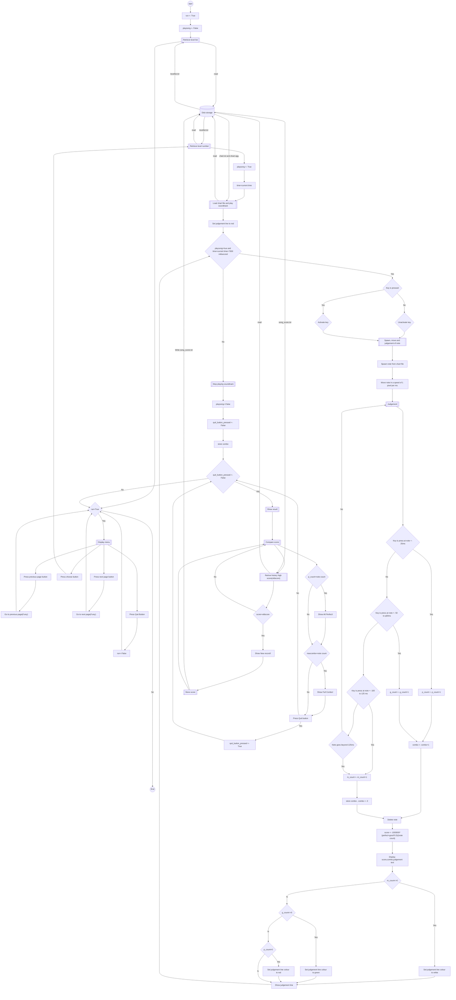
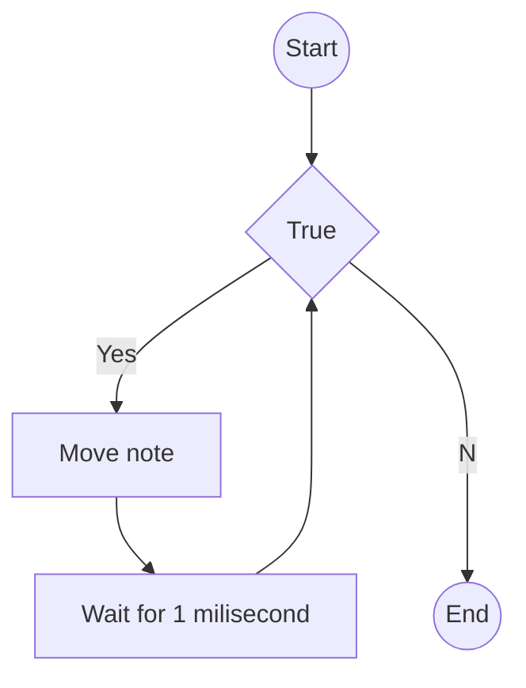

# Simple Rhythm Game


# 1. Background
## 1.1 Objective
The objective of the game is originally to teach primary students to know different rhythm patterns. However, with the development of the game, the game now also enables players to make their chart afther learning music theory.

## 1.2 Programming language
Python is used in the project. The task required us to use Python. Besides that, there are some advantange of Python over other programming languages.
- Easy to use
  - Python has a simple syntax compared to other programming language e.g. C++ and Java.
  - Python is many built in modules. We can use the modules so save our time.
- Large community
  - There are many unofficial libraries made by various people online. Also, we can easily download them using command prompt, e.g.
  ```
  pip install XXX
  ```
  - We can find useful answer on forums like StackOverflow

Pygame is the only external library that I have used.


# 2. Layout
## 2.1 Preview


## 2.2 How to play
This is a tradtional rhythm game. The notes will fall down. Hit the note when it reaches the judgement line.<br/>
<br/>
There are two lanes.
Hit the notes at the left lane with "G" Key. Hit the notes at the right lane with "H" Key.
## 2.3 Judgement
A judgement system is essential for a rhythm game. Therefore, I would like to introduce the judgement system of the game.<br>
This game contains a judgement line. The note will fall exactly on the line on its note timing.<br>
The game has a maximum mark of 1000000. It has three judgements: perfect, good and miss.<br>
A perfect notes account for (maximum mark/total number of notes). You have to hit at +-50ms of the note timing for getting a perfect.<br>
A good notes account for halved mark of perfect note. You have to hit at +-50 to 100ms of the note timing for getting a good.<br>
If you hit the note at +- 100ms to 125ms or do not hit the note after 125ms of the note timing, you will get a miss. Getting a miss will reset the combo to 0
and you will ot receive and mark.<br>

The judgement line is red in colour in default. It indicates all the notes you hit are perfect.<br>
If a good is obtained. It will change to green.<br>
If a miss is obtained. It will change to white.<br>
# 3. Algorithm Design and Program Development
## 3.1 Overall Algorithm Structure

> __main.py__
```
import pygame
from pygame import mixer
import os
l=720
w=900
win = pygame.display.set_mode((l, w),pygame.SCALED,pygame.RESIZABLE)

pygame.init()
mixer.init()
# set the pygame window name  
pygame.display.set_caption("Simple rhythm game") 
text_font=pygame.font.SysFont("Arial",28)
big_font=pygame.font.SysFont("Arial",48)
color_light = (170,170,170) 
color_dark = (100,100,100)
def drawtext(text,font,text_colour,x,y):
    img = font.render(text,True,text_colour)
    win.blit(img,(x,y))
# dimensions of the object
timing1=timing2=None
judge_str1=judge_str2=""
  
# velocity / speed of movement
fps=120
vel = 1000/fps
screencolour=(0, 0, 0)
rects=[]
timing=[]
clock = pygame.time.Clock()
pagenum=1
class key:
    def __init__(self,x,y,sx,sy,colour,keyboard):
        self.x=x
        self.y=y
        self.sx=sx
        self.sy=sy
        self.colour=colour
        self.keyboard = keyboard
        self.rect = pygame.Rect(self.x,self.y,sx,sy)
        self.handled = False

keys=[
    key(190,635,100,25,(255, 0, 0),pygame.K_g),
    key(190,635,100,25,(255, 0, 0),pygame.K_g),
    key(430,870,100,25,(255, 0, 0),pygame.K_h),
    key(430,870,100,25,(255, 0, 0),pygame.K_h),
    ]
keys_g=[
    key(190,670,100,50,(0, 255, 0),pygame.K_g),
    key(430,670,100,50,(0, 255, 0),pygame.K_h),
    key(190,820,100,50,(0, 255, 0),pygame.K_g),
    key(430,820,100,50,(0, 255, 0),pygame.K_h),    
       ]

keys_p=[
    key(190,720,100,100,(0, 0, 255),pygame.K_g),
    key(430,720,100,100,(0, 0, 255),pygame.K_h),      
       ]
def menureadlevel():
    f=open("levellist.txt", "r")
    a=f.readlines()
    for i in range (0,len(a)):
        a[i]=a[i].replace("\n","")
        a[i]=a[i].split(",")
    return a

def readlevel(level):
    level=int(level)
    f=open("levellist.txt", "r")
    a=f.readlines()
    for i in range (0,len(a)):
        a[i]=a[i].replace("\n","")
        a[i]=a[i].split(",")
    name=a[level][0]
    composer=a[level][1]
    return name,composer


def readchart(chart):
    mixer.music.load(chart+".ogg")#load music
    pygame.display.set_caption(chart)#set window caption to song
    f=open(chart+".txt", "r")#open chart text
    a=f.readlines()#retrive chart text
    #convert chart text to list
    for i in range (0,len(a)):
        a[i]=a[i].replace("\n","")
        a[i]=a[i].split(",")
        a[i][0]=int(a[i][0])
        a[i][1]=int(a[i][1])
       #spawn notes as rectangles 
        if a[i][1]==0:
            rects.append(pygame.Rect(215,(a[i][0]-770)/-1,50,25))
        elif a[i][1]==1:
            rects.append(pygame.Rect(465,(a[i][0]-770)/-1,50,25))
    f.close
    return rects,len(a),a#return values

def writescore(chart,score):
    a=0
    if not os.path.exists(chart+"_score.txt"):
        f=open(chart+"_score.txt", "w")
        f.write("0")
        f.close()
    f=open(chart+"_score.txt", "w")
    f.write(str(score))
    f.close()

def readscore(chart):
    a=0
    if not os.path.exists(chart+"_score.txt"):
        f=open(chart+"_score.txt", "w")
        f.write("0")
        f.close()
    f=open(chart+"_score.txt", "r")
    a=int(f.readline())
    return a

# Indicates pygame is running
run = True#status of whether the mainloop is running
playsong = False#status of whether you are playing a song
levelnum=-1#the chart's corresponding number
level=menureadlevel()
while run:    # infinite loop
    clock.tick(fps)#run the game at certain FPS
    for event in pygame.event.get():
          
            # if event object type is QUIT   
            # then quitting the pygame   
            # and program both.   
            if event.type == pygame.QUIT: 
              
                # it will make exit the while loop  
                run = False
                pygame.quit() 
    

    while playsong==False:
        for event in pygame.event.get():
          
            # if event object type is QUIT   
            # then quitting the pygame   
            # and program both.
             if event.type == pygame.QUIT: 
              
                # it will make exit the while loop  
                run = False
                pygame.quit() 
             if event.type == pygame.MOUSEBUTTONDOWN: 
                #if the mouse is clicked on the button the game is terminated 
                if l/2-60<= mouse[0] <= l/2+60 and 800 <= mouse[1] <= 840: 
                    pygame.quit()
                if 500<= mouse[0] <= 620 and 220 <= mouse[1] <= 260: 
                    levelnum=(pagenum-1)*3
                    playsong=True
                if pagenum*3<=len(level):
                    if 500<= mouse[0] <= 620 and 620 <= mouse[1] <= 660: 
                        levelnum=2+(pagenum-1)*3
                        playsong=True
                    if pagenum*3<=len(level)-1 or 1+(pagenum-1)*3 == 1:
                        if 500<= mouse[0] <= 620 and 420 <= mouse[1] <= 460: 
                            levelnum=1+(pagenum-1)*3
                            playsong=True
                if 0<= mouse[0] <= 30 and 700 <= mouse[1] <= 800: 
                    if pagenum-1==len(level)//3 or len(level)==3:
                        pagenum=1
                    else:
                        pagenum+=1
                if pagenum>1 and 0<= mouse[0] <= 30 and 100 <= mouse[1] <= 200: 
                        pagenum-=1
        # fills the screen with a color 
        win.fill(screencolour)
        
        # stores the (x,y) coordinates into 
        # the variable as a tuple 
        mouse = pygame.mouse.get_pos()
        if l/2-60<= mouse[0] <= l/2+60 and 800 <= mouse[1] <= 840: 
            pygame.draw.rect(win,color_light,[l/2-60,800,120,40])       
        else: 
            pygame.draw.rect(win,color_dark,[l/2-60,800,120,40])
        if pagenum*3<=len(level):   
            if 500<= mouse[0] <= 620 and 620 <= mouse[1] <= 660: 
                pygame.draw.rect(win,color_light,[500,620,120,40])       
            else: 
                pygame.draw.rect(win,color_dark,[500,620,120,40])
            if pagenum*3<=len(level)-1 or 1+(pagenum-1)*3 == 1:
                if 500<= mouse[0] <= 620 and 420 <= mouse[1] <= 460: 
                    pygame.draw.rect(win,color_light,[500,420,120,40])       
                else: 
                    pygame.draw.rect(win,color_dark,[500,420,120,40])
                
        if 500<= mouse[0] <= 620 and 220 <= mouse[1] <= 260: 
            pygame.draw.rect(win,color_light,[500,220,120,40])       
        else: 
            pygame.draw.rect(win,color_dark,[500,220,120,40])
        if pagenum>1:
            if 0<= mouse[0] <= 30 and 100 <= mouse[1] <= 200: 
                pygame.draw.rect(win,color_light,[0,100,30,100])       
            else: 
                pygame.draw.rect(win,color_dark,[0,100,30,100])
        if len(level)>3:
            if 0<= mouse[0] <= 30 and 700 <= mouse[1] <= 800: 
                pygame.draw.rect(win,color_light,[0,700,30,100])       
            else: 
                pygame.draw.rect(win,color_dark,[0,700,30,100]) 
        # superimposing the text onto our buttons
        drawtext("Quit",text_font,(255,255,255),l/2-30,800)
        if len(level)>3:
            drawtext("v",text_font,(255,255,255),15,750)
        if pagenum>1:
            drawtext("^",text_font,(255,255,255),15,150)
        drawtext(level[(pagenum-1)*3][0],big_font,(255,255,255),100,200)
        drawtext(level[(pagenum-1)*3][1],text_font,(255,255,255),100,260)
        drawtext("Choose",text_font,(255,255,255),510,220)
        drawtext("Highest score:"+str(readscore(level[(pagenum-1)*3][0])),text_font,(255,255,255),100,300)
        if pagenum*3<=len(level):
            drawtext("Choose",text_font,(255,255,255),510,620)
            drawtext(level[2+(pagenum-1)*3][0],big_font,(255,255,255),100,600)
            drawtext(level[2+(pagenum-1)*3][1],text_font,(255,255,255),100,660)
            drawtext("Highest score:"+str(readscore(level[2+(pagenum-1)*3][0])),text_font,(255,255,255),100,700)                                                                     
            if pagenum*3<=len(level)-1 or 1+(pagenum-1)*3 == 1:
                drawtext("Choose",text_font,(255,255,255),510,420)
                drawtext(level[1+(pagenum-1)*3][0],big_font,(255,255,255),100,400)
                drawtext(level[1+(pagenum-1)*3][1],text_font,(255,255,255),100,460)
                drawtext("Highest score:"+str(readscore(level[1+(pagenum-1)*3][0])),text_font,(255,255,255),100,500)

        pygame.display.update()
    #read chart file from level list
    cname,ccomposer=readlevel(levelnum)
    chartname=cname.lower()
    chart_rects,note_count,timing_list=readchart(chartname)
    combo=0#Shows combo
    p_count=0#Number of perfect note
    g_count=0#Number of good note
    m_count=0#Number of miss note
    combo_list=[]#Stores combos
    score=0#Shows score
    playsong = True
    linec=(255,0,0)#judgement line colour, red in default
    
    win.fill(screencolour)
    drawtext("Loading...",big_font,(255,255,255),250,450)
    pygame.display.update()
    pygame.time.delay(2000)
    
    start_t=pygame.time.get_ticks()
    
    #Play music
    mixer.music.set_volume(0.5)
    mixer.music.play()
    
    #Playing loop
    while playsong and pygame.time.get_ticks()<=(timing_list[note_count-1][0]+7000+start_t):
        win.fill(screencolour) 
        # iterate over the list of Event objects   
        # that was returned by pygame.event.get() method.   
        for event in pygame.event.get(): 
          
            # if event object type is QUIT   
            # then quitting the pygame   
            # and program both.   
            if event.type == pygame.QUIT: 
              
                # it will make exit the while loop  
                run = False
                pygame.quit()
        #Check whether a key is pressed
        k = pygame.key.get_pressed()
        for key in keys_p:
            if k[key.keyboard]:
                key.handled=True
            if not(k[key.keyboard]):
                key.handled=False
        for key in keys_g:
            if k[key.keyboard]:
                key.handled=True
            if not(k[key.keyboard]):
                key.handled=False
        for key in keys:
            if k[key.keyboard]:
                key.handled=True
            if not(k[key.keyboard]):
                key.handled=False
        
        for rect in chart_rects:
            #Spawn notes
            pygame.draw.rect(win,(255,0,0),rect)
            #Move notes
            rect.y+=vel
            #Judgement
            if rect.y>895:
                if rect.x==215:
                    timing1=pygame.time.get_ticks()
                    judge_str1="Miss"
                elif rect.x==465:
                    timing2=pygame.time.get_ticks()
                    judge_str2="Miss"
                chart_rects.remove(rect)
                combo_list.append(combo)
                combo=0
                m_count+=1
                break
            for key in keys_p:
                if rect.colliderect(key.rect) and key.handled==True:
                    if 720<rect.y<820:
                        key.handled=False
                        if rect.x==215:
                            timing1=pygame.time.get_ticks()
                            judge_str1="Perfect"
                        elif rect.x==465:
                            timing2=pygame.time.get_ticks()
                            judge_str2="Perfect"
                        chart_rects.remove(rect)
                        p_count+=1
                        combo+=1
                        break
                    else:
                        for key in keys_g:
                            if rect.colliderect(key.rect) and key.handled==True:
                                if 670<rect.y<720 or 820<rect.y<870:
                                    key.handled=False
                                    if rect.x==215:
                                        timing1=pygame.time.get_ticks()
                                        judge_str1="Good"
                                    elif rect.x==465:
                                        timing2=pygame.time.get_ticks()
                                        judge_str2="Good"
                                    chart_rects.remove(rect)
                                    g_count+=1
                                    combo+=1
                                    break
                                else:
                                    for key in keys:
                                        if rect.colliderect(key.rect) and key.handled==True:
                                            if 635<rect.y<670 or 870<rect.y<895:
                                                key.handled=False
                                                if rect.x==215:
                                                    timing1=pygame.time.get_ticks()
                                                    judge_str1="Miss"
                                                elif rect.x==465:
                                                    timing2=pygame.time.get_ticks()
                                                    judge_str2="Miss"
                                                chart_rects.remove(rect)
                                                combo_list.append(combo)
                                                m_count+=1
                                                combo=0
                                                break
                                break
                            break
                        break
                    break
        #Adjust the colour of judgement line
        if m_count!=0:
            linec=(255,255,255)#White line means there is miss
        elif g_count!=0:
            linec=(0,255,0)#Green line means there is good, but still full combo
        else:
            linec=(255,0,0)#Red line means all perfect
        
        #draw the judgemnent line
        pygame.draw.rect(win,linec,pygame.Rect(0,770,900,1))
        
        #calculate and show score
        score=round(1000000*((p_count+0.5*g_count)/note_count))
        drawtext(str(score),text_font,(255,255,255),0,30)
        
        #show combo
        drawtext("Combo "+str(combo),text_font,(255,255,255),0,0)
        if timing1 is not None and pygame.time.get_ticks()-timing1<1000:
            drawtext(judge_str1,text_font,(255,255,255),50,770)
        if timing2 is not None and pygame.time.get_ticks()-timing2<1000:
            drawtext(judge_str2,text_font,(255,255,255),600,770)
        else:
            p_timing=None
        #run the game at certain FPS
        clock.tick(fps)
        pygame.display.update()
       
    #After the song end, transition to result screen
    pygame.mixer.stop()
    win.fill(screencolour) 
    pygame.display.update()
    pygame.display.set_caption("Results") 
    combo_list.append(combo)
    maxcombo=max(combo_list)#Calculate max combo
    quit_button_pressed=False#Status 
    playsong=False#The gameplay has ended
    highornot=""
    while quit_button_pressed==False: 
      
        for event in pygame.event.get(): 
          
            if event.type == pygame.QUIT: 
                pygame.quit() 
              
            #checks if a mouse is clicked 
            if event.type == pygame.MOUSEBUTTONDOWN: 
              
                #if the mouse is clicked on the 
                # button the game is terminated 
                if w/2 <= mouse[0] <= w/2+140 and l/2 <= mouse[1] <= l/2+40: 
                    quit_button_pressed=True
                  
        # fills the screen with a color 
        win.fill(screencolour)
        # stores the (x,y) coordinates into 
        # the variable as a tuple 
        mouse = pygame.mouse.get_pos() 
      
        # if mouse is hovered on a button it 
        # changes to lighter shade  
        if w/2 <= mouse[0] <= w/2+140 and l/2 <= mouse[1] <= l/2+40: 
            pygame.draw.rect(win,color_light,[w/2,l/2,140,40])       
        else: 
            pygame.draw.rect(win,color_dark,[w/2,l/2,140,40]) 
        # superimposing the text onto our button 
        drawtext("Quit",text_font,(255,255,255),w/2+50,l/2)
        drawtext("Score: "+str(score),text_font,(255,255,255),50,25)
        drawtext("Perfect: "+str(p_count),text_font,(255,255,255),75,100)
        drawtext("Good: "+str(g_count),text_font,(255,255,255),75,130)
        drawtext("Miss: "+str(m_count),text_font,(255,255,255),75,160)
        drawtext("Max Combo: "+str(maxcombo),text_font,(255,255,255),50,55)
        drawtext(str(cname),big_font,(255,255,255),50,250)
        drawtext(str(ccomposer),text_font,(255,255,255),50,320)
        if p_count==note_count:
            drawtext("All Perfect!",big_font,(255,255,255),400,55)
        elif maxcombo==note_count:
            drawtext("Full Combo!",big_font,(255,255,255),400,55)
        oldscore=readscore(chartname)
        drawtext(highornot,big_font,(255,255,255),400,200)
        if score>oldscore:
            writescore(chartname,score)
            highornot="New Record!"
      
        # updates the frames of the game 
        pygame.display.update()
    
pygame.quit()
```
>Flowchart


## 3.2 Libraries
```
import pygame
```
Import the main library of the game, pygame.
___
```
from pygame import mixer
```
Import the mixer module of pygame, which is used to play soundtrack later.
___
```
import os
```
This is to determine whether the file of highest score exists later
___
## 3.3 External Data Structure
### 3.3.1 External Data
There are three types of exteral data. All of them are in form of plain text(.txt).
> levellist.txt
```
Introduction,??
Kronos,Sakuzyo
Dropdead,Frums
X,Yuta Imai
X,Yuta Imai
X,Yuta Imai
X,Yuta Imai
```
It has the structure of (songname),(composer). It stores the information of the songs.
___
> (songname)_score.txt
```
(highest gamplay score history of (songname))
```
___
> (songname).txt
```
(timing),(lane)
```
Timing is the time(in milisecond) for the note to reach the judgement line.
Lane is where the notes will fall. It has the value of 0 or 1.
___
> (songname).ogg
This is the soundtrack of the song.
___
### 3.3.2 Subprogram used to read and/or write the external data

> menureadlevel()
```
def menureadlevel():
    f=open("levellist.txt", "r")
    a=f.readlines()
    for i in range (0,len(a)):
        a[i]=a[i].replace("\n","")
        a[i]=a[i].split(",")
    return a
```
The subprogram is to split the information of the songs and display it on the main menu.
The variable _a_ returnes is a list which contains songname in _a[i][0]_ and contains the composer in _a[i][1]_, where _i_ can be any integar between 0 and len(a)-1
___
> readlevel(level)
```
def readlevel(level):
    level=int(level)
    f=open("levellist.txt", "r")
    a=f.readlines()
    for i in range (0,len(a)):
        a[i]=a[i].replace("\n","")
        a[i]=a[i].split(",")
    name=a[level][0]
    composer=a[level][1]
    return name,composer
```
This program is to retrive information of a specific song to be used in window caption and result screen, where the attribute _level_ is the value indicates the song.
___
> readchart(chart)
```
readchart(chart):
    mixer.music.load(chart+".ogg")#load music
    pygame.display.set_caption(chart)#set window caption to song
    f=open(chart+".txt", "r")#open chart text
    a=f.readlines()#retrive chart text
    #convert chart text to list
    for i in range (0,len(a)):
        a[i]=a[i].replace("\n","")
        a[i]=a[i].split(",")
        a[i][0]=int(a[i][0])
        a[i][1]=int(a[i][1])
       #spawn notes as rectangles 
        if a[i][1]==0:
            rects.append(pygame.Rect(215,(a[i][0]-770)/-1,50,25))
        elif a[i][1]==1:
            rects.append(pygame.Rect(465,(a[i][0]-770)/-1,50,25))
    f.close()
    return rects,len(a),a
```
The attribute _chart_ comes from the _a[i][0]_ of _readlevel(level)_, which is the song name. This subprogram is to use the _chart_ attribute to find _songname_ and loads _(songname).txt_ and _(songname).ogg_. The chart file _(songname).txt_ is opened and its data is split into _timing_ (_a[i][0]_) and _lane_ (_a[i][1]_). The notes are spawned in rectangles.
For the values returned, _rects_ is the list of rectangles(notes), _len(a)_ is the total note count which will be used to calculate marks, and _a_ is the spilted list of _(songname).txt_.
___
> readscore(chart,score)
```
def readscore(chart):
    a=0
    if not os.path.exists(chart+"_score.txt"):
        f=open(chart+"_score.txt", "w")
        f.write("0")
        f.close()
    f=open(chart+"_score.txt", "r")
    a=int(f.readline())
    return a
```
The attribute _chart_ comes from the _a[i][0]_ of _readlevel(level)_, which is the song name. This subprogram is to read the highest gameplay score history of the song((songname)_score.txt). If the file does not exist, a new file of _(songname)_score.txt_ will be generated with a default value set as 0. After that, the highest score history will be retrived and returned as _a_.
___
> writescore(chart,score)
```
def writescore(chart,score):
    a=0
    if not os.path.exists(chart+"_score.txt"):
        f=open(chart+"_score.txt", "w")
        f.write("0")
        f.close()
    f=open(chart+"_score.txt", "w")
    f.write(str(score))
    f.close()
```
The attribute _chart_ comes from the _a[i][0]_ of _readlevel(level)_, which is the song name. The attibute _score_ is the gameplay score of the latest gameplay. This subprogram is to read the highest gameplay score history of the song((songname)_score.txt). If the file does not exist, a new file of _(songname)_score.txt_ will be generated with a default value set as 0. After that, the highest score history will be replaced with _score_.
___
## 3.4 Initialization
```
l=720
w=900
win = pygame.display.set_mode((l, w),pygame.SCALED,pygame.RESIZABLE)
```
The windows size is set up to be _l_ in length and _w_ in width. In default, the window is set to be 720*900 pixels.
___
```
pygame.init()
```
Initializes main module, pygame.
___
```
mixer.init()
```
Initializes pygame's mixer module for playing soundtrack.
___
```
pygame.display.set_caption("Simple rhythm game") 
```
Set the caption of the window.
___
```
text_font=pygame.font.SysFont("Arial",28)
big_font=pygame.font.SysFont("Arial",48)
color_light = (170,170,170) 
color_dark = (100,100,100)
def drawtext(text,font,text_colour,x,y):
    img = font.render(text,True,text_colour)
    win.blit(img,(x,y))
```
Define the font type and colour. Then, a subprogram is defined to reder the text in a simplier way.
___
```
timing1=timing2=None
judge_str1=judge_str2=""
```
Initialize the judgment text.
___
```
fps=120
vel = 1000/fps
```
Set speed of falling notes
___
```
screencolour=(0, 0, 0)
```
Set the screen to black.
___
```
rects=[]
timing=[]
```
Initialize timing note rectangle list and timing list.
___
```
clock = pygame.time.Clock()
```
Initialize FPS(frame per second) module
___
```
pagenum=1
```
Set page number of main menu to 1
___
```
class key:
    def __init__(self,x,y,sx,sy,colour,keyboard):
        self.x=x
        self.y=y
        self.sx=sx
        self.sy=sy
        self.colour=colour
        self.keyboard = keyboard
        self.rect = pygame.Rect(self.x,self.y,sx,sy)
        self.handled = False

keys=[
    key(190,635,100,25,(255, 0, 0),pygame.K_g),
    key(190,635,100,25,(255, 0, 0),pygame.K_g),
    key(430,870,100,25,(255, 0, 0),pygame.K_h),
    key(430,870,100,25,(255, 0, 0),pygame.K_h),
    ]
keys_g=[
    key(190,670,100,50,(0, 255, 0),pygame.K_g),
    key(430,670,100,50,(0, 255, 0),pygame.K_h),
    key(190,820,100,50,(0, 255, 0),pygame.K_g),
    key(430,820,100,50,(0, 255, 0),pygame.K_h),    
       ]
```
Define class _key_, which are rectangles for judgement
Parameters explained:
_x_ : The x-coordinate of the top left corner of the judgement rectangle
_y_ : The y-coordinate of the top left corner of the judgement rectangle
_sx_ : The size of the rectangle in x-axis
_sy_ : The size of the rectangle in y-axis
_colour_ : Colour of the rectangle(useless)
_keyboard_ : The key on the keyboard to activate the rectangle("G" or "H")
_handled_ :Boolean of whether the rectangle is activated
___
## 3.5 Main Loop
### 3.5.1 Pre-loop initialization
```
run = True
```
Status of whether the mainloop is running
___
```
playsong = False
```
Status of whether you are playing a song
___
```
levelnum=-1
```
The chart's corresponding number, is -1 in default
___
```
level=menureadlevel()
```
Fetch a list of songs toio display in menu
___
```
while run:
    clock.tick(fps)
```
Run the game at certain FPS(defined in initialization)
___
```
    for event in pygame.event.get():
          
            # if event object type is QUIT   
            # then quitting the pygame   
            # and program both.   
            if event.type == pygame.QUIT: 
              
                # it will make exit the while loop  
                run = False
                pygame.quit()
```
Set a _quit_ event for pressing the cross button(pygame default)
___
### 3.5.2 Menu Loop
```
    while playsong==False:
        for event in pygame.event.get():
          
            # if event object type is QUIT   
            # then quitting the pygame   
            # and program both.
             if event.type == pygame.QUIT: 
        
                # it will make exit the while loop  
                run = False
                pygame.quit() 
```
Set a _quit_ event for pressing the cross button(pygame default)
___
```
             if event.type == pygame.MOUSEBUTTONDOWN: 
                #if the mouse is clicked on the button the game is terminated 
                if l/2-60<= mouse[0] <= l/2+60 and 800 <= mouse[1] <= 840: 
                    pygame.quit()
```
Capture mouse event for pressing _Quit_ button.
___
```
                if 500<= mouse[0] <= 620 and 220 <= mouse[1] <= 260: 
                    levelnum=(pagenum-1)*3
                    playsong=True
                if pagenum*3<=len(level):
                    if 500<= mouse[0] <= 620 and 620 <= mouse[1] <= 660: 
                        levelnum=2+(pagenum-1)*3
                        playsong=True
                    if pagenum*3<=len(level)-1 or 1+(pagenum-1)*3 == 1:
                        if 500<= mouse[0] <= 620 and 420 <= mouse[1] <= 460: 
                            levelnum=1+(pagenum-1)*3
                            playsong=True
```
Capture mouse event for pressing _Play_ buttons.
___
```
                if 0<= mouse[0] <= 30 and 700 <= mouse[1] <= 800: 
                    if pagenum-1==len(level)//3 or len(level)==3:
                        pagenum=1
                    else:
                        pagenum+=1
                if pagenum>1 and 0<= mouse[0] <= 30 and 100 <= mouse[1] <= 200: 
                        pagenum-=1
```
Capture mouse event for pressing buttons for switching pages.
Each page can show up to 3 songs.
___
```
        # fills the screen with a color 
        win.fill(screencolour)
```
Fills the screen with a colour.
___
```
        # stores the (x,y) coordinates into 
        # the variable as a tuple 
        mouse = pygame.mouse.get_pos()
        if l/2-60<= mouse[0] <= l/2+60 and 800 <= mouse[1] <= 840: 
            pygame.draw.rect(win,color_light,[l/2-60,800,120,40])       
        else: 
            pygame.draw.rect(win,color_dark,[l/2-60,800,120,40])
        if pagenum*3<=len(level):   
            if 500<= mouse[0] <= 620 and 620 <= mouse[1] <= 660: 
                pygame.draw.rect(win,color_light,[500,620,120,40])       
            else: 
                pygame.draw.rect(win,color_dark,[500,620,120,40])
            if pagenum*3<=len(level)-1 or 1+(pagenum-1)*3 == 1:
                if 500<= mouse[0] <= 620 and 420 <= mouse[1] <= 460: 
                    pygame.draw.rect(win,color_light,[500,420,120,40])       
                else: 
                    pygame.draw.rect(win,color_dark,[500,420,120,40])
                
        if 500<= mouse[0] <= 620 and 220 <= mouse[1] <= 260: 
            pygame.draw.rect(win,color_light,[500,220,120,40])       
        else: 
            pygame.draw.rect(win,color_dark,[500,220,120,40])
        if pagenum>1:
            if 0<= mouse[0] <= 30 and 100 <= mouse[1] <= 200: 
                pygame.draw.rect(win,color_light,[0,100,30,100])       
            else: 
                pygame.draw.rect(win,color_dark,[0,100,30,100])
        if len(level)>3:
            if 0<= mouse[0] <= 30 and 700 <= mouse[1] <= 800: 
                pygame.draw.rect(win,color_light,[0,700,30,100])       
            else: 
                pygame.draw.rect(win,color_dark,[0,700,30,100])
```
Draw the buttons. Capture the mouse positions for button to light up while hovering on it.
___
```
        # superimposing the text onto our buttons
        drawtext("Quit",text_font,(255,255,255),l/2-30,800)
        if len(level)>3:
            drawtext("v",text_font,(255,255,255),15,750)
        if pagenum>1:
            drawtext("^",text_font,(255,255,255),15,150)
        drawtext(level[(pagenum-1)*3][0],big_font,(255,255,255),100,200)
        drawtext(level[(pagenum-1)*3][1],text_font,(255,255,255),100,260)
        drawtext("Choose",text_font,(255,255,255),510,220)
        drawtext("Highest score:"+str(readscore(level[(pagenum-1)*3][0])),text_font,(255,255,255),100,300)
        if pagenum*3<=len(level):
            drawtext("Choose",text_font,(255,255,255),510,620)
            drawtext(level[2+(pagenum-1)*3][0],big_font,(255,255,255),100,600)
            drawtext(level[2+(pagenum-1)*3][1],text_font,(255,255,255),100,660)
            drawtext("Highest score:"+str(readscore(level[2+(pagenum-1)*3][0])),text_font,(255,255,255),100,700)                                                                     
            if pagenum*3<=len(level)-1 or 1+(pagenum-1)*3 == 1:
                drawtext("Choose",text_font,(255,255,255),510,420)
                drawtext(level[1+(pagenum-1)*3][0],big_font,(255,255,255),100,400)
                drawtext(level[1+(pagenum-1)*3][1],text_font,(255,255,255),100,460)
                drawtext("Highest score:"+str(readscore(level[1+(pagenum-1)*3][0])),text_font,(255,255,255),100,500)
```
Superimposting texts to the buttons.
___
```
        pygame.display.update()
```
Update the screen display.
___
### 3.5.3 Initialization of play loop after selection of song 
```
    #read chart file from level list
    cname,ccomposer=readlevel(levelnum)
    chartname=cname.lower()
    chart_rects,note_count,timing_list=readchart(chartname)
```
Initialize the chart by reading the chart file (explained in readlevel() and readchart() in Section 3.3)
___
```
    combo=0#Shows combo
    p_count=0#Number of perfect note
    g_count=0#Number of good note
    m_count=0#Number of miss note
    combo_list=[]#Stores combos
```
Initialize the number of combo and the number of perfect,good and miss respectively.
Note: _combo_list_ is for storing combos.
___
```
    score=0#Shows score
```
Initialize score.
___
```
    playsong = True
```
Indicates that you are playing a song.
___
```
    linec=(255,0,0)#judgement line colour, red in default
```
Initialize the colour of judgement line(red in deault).
___
```
    win.fill(screencolour)
    drawtext("Loading...",big_font,(255,255,255),250,450)
    pygame.display.update()
    pygame.time.delay(2000)
```
A fake loading screen last for 2 seconds as transition for players to prepare.
___
```
    start_t=pygame.time.get_ticks()
```
Record the time of starting.
```
    #Play music
    mixer.music.set_volume(0.5)
    mixer.music.play()
```
Play the soundtrack.
___
### 3.5.4 PLay loop
```
    #Playing loop
    while playsong and pygame.time.get_ticks()<=(timing_list[note_count-1][0]+7000+start_t):
```
The playing loop will last from here until 7 seconds after the last note has reached the judgement line.
___
```
        win.fill(screencolour) 
        # iterate over the list of Event objects   
        # that was returned by pygame.event.get() method.   
        for event in pygame.event.get(): 
          
            # if event object type is QUIT   
            # then quitting the pygame   
            # and program both.   
            if event.type == pygame.QUIT: 
              
                # it will make exit the while loop  
                run = False
                pygame.quit()
```
Common structure of a pygame loop. Explained in the above section.
___
```
        #Check whether a key is pressed
        k = pygame.key.get_pressed()
        for key in keys_p:
            if k[key.keyboard]:
                key.handled=True
            if not(k[key.keyboard]):
                key.handled=False
        for key in keys_g:
            if k[key.keyboard]:
                key.handled=True
            if not(k[key.keyboard]):
                key.handled=False
        for key in keys:
            if k[key.keyboard]:
                key.handled=True
            if not(k[key.keyboard]):
                key.handled=False
```
To check for whether a key is pressed.
The judgement rectangle will activate on press.
___
```
        for rect in chart_rects:
            #Spawn notes
            pygame.draw.rect(win,(255,0,0),rect)
```
Spawn notes.
___
```
            #Move notes
            rect.y+=vel
```
Move notes in a speed of averagely 1 pixel per milisecond.(Varieable _vel_ is explained in 3.4.1)
___
>For judgement explanation, please refer to section 2.3.
___

```
            #Judgement
            if rect.y>895:
                if rect.x==215:
                    timing1=pygame.time.get_ticks()
                    judge_str1="Miss"
                elif rect.x==465:
                    timing2=pygame.time.get_ticks()
                    judge_str2="Miss"
                chart_rects.remove(rect)
                combo_list.append(combo)
                combo=0
                m_count+=1
                break
```
Judgement of miss for not hitting afgter 125ms of the note timing.
Combo after miss note is stored into _combo_list_.
___
```
            for key in keys_p:
                if rect.colliderect(key.rect) and key.handled==True:
                    if 720<rect.y<820:
                        key.handled=False
                        if rect.x==215:
                            timing1=pygame.time.get_ticks()
                            judge_str1="Perfect"
                        elif rect.x==465:
                            timing2=pygame.time.get_ticks()
                            judge_str2="Perfect"
                        chart_rects.remove(rect)
                        p_count+=1
                        combo+=1
                        break
```
Judgement of perfect note.
___
```
                    else:
                        for key in keys_g:
                            if rect.colliderect(key.rect) and key.handled==True:
                                if 670<rect.y<720 or 820<rect.y<870:
                                    key.handled=False
                                    if rect.x==215:
                                        timing1=pygame.time.get_ticks()
                                        judge_str1="Good"
                                    elif rect.x==465:
                                        timing2=pygame.time.get_ticks()
                                        judge_str2="Good"
                                    chart_rects.remove(rect)
                                    g_count+=1
                                    combo+=1
                                    break
```
Judgement of good note.
___
```
                                else:
                                    for key in keys:
                                        if rect.colliderect(key.rect) and key.handled==True:
                                            if 635<rect.y<670 or 870<rect.y<895:
                                                key.handled=False
                                                if rect.x==215:
                                                    timing1=pygame.time.get_ticks()
                                                    judge_str1="Miss"
                                                elif rect.x==465:
                                                    timing2=pygame.time.get_ticks()
                                                    judge_str2="Miss"
                                                chart_rects.remove(rect)
                                                combo_list.append(combo)
                                                m_count+=1
                                                combo=0
                                                break
```
Judgement of miss note for hitting at +- 100 to 125 ms.
Combo after miss note is stored into _combo_list_.
___
```
                                break
                            break
                        break
                    break
```
End of judgement.
___
```
        #Adjust the colour of judgement line
        if m_count!=0:
            linec=(255,255,255)#White line means there is miss
        elif g_count!=0:
            linec=(0,255,0)#Green line means there is good, but still full combo
        else:
            linec=(255,0,0)#Red line means all perfect

        #draw the judgemnent line
        pygame.draw.rect(win,linec,pygame.Rect(0,770,900,1))
```
Change the colour and draw judgement line.
___
```
        #calculate and show score
        score=round(1000000*((p_count+0.5*g_count)/note_count))
        drawtext(str(score),text_font,(255,255,255),0,30)
```
Show score.
___
```
        #show combo
        drawtext("Combo "+str(combo),text_font,(255,255,255),0,0)
```
Show combo.
___
```
        if timing1 is not None and pygame.time.get_ticks()-timing1<1000:
            drawtext(judge_str1,text_font,(255,255,255),50,770)
        if timing2 is not None and pygame.time.get_ticks()-timing2<1000:
            drawtext(judge_str2,text_font,(255,255,255),600,770)
        else:
            p_timing=None
```
Show judgement text. It last for one second at most.
```
        #run the game at certain FPS
        clock.tick(fps)
        pygame.display.update()
```
Run the game at certain fps(discussed in 3.4)
___
### 3.5.5 Transition from play loop to result screen
```
    #After the song end, transition to result screen
    pygame.mixer.stop()
```
Stop the music.
___
```
    win.fill(screencolour) 
    pygame.display.update()
```
Clear the screen.
___
```
    pygame.display.set_caption("Results")
```
Change the caption.
___
```
    combo_list.append(combo)
    maxcombo=max(combo_list)#Calculate max combo
```
Store the last combo to _combo_list_ and find out the highest combo.
___
```
    quit_button_pressed=False#Status
```
Initialize the quit button status.
___
```
    playsong=False#The gameplay has ended
```
Indicates the end of playing.
___
```
    highornot=""
```
Initialize the string for "New Record!"
___
### 3.5.6 Result screen
```
    while quit_button_pressed==False:
```
The result screen will sustain before pressing the quit button.
___
```
        for event in pygame.event.get(): 
          
            if event.type == pygame.QUIT: 
                pygame.quit() 
```
___
```
            #checks if a mouse is clicked 
            if event.type == pygame.MOUSEBUTTONDOWN: 
              
                #if the mouse is clicked on the 
                # button the game is terminated 
                if w/2 <= mouse[0] <= w/2+140 and l/2 <= mouse[1] <= l/2+40: 
                    quit_button_pressed=True
```
Capture mouse event of pressing the _quit_ button.
```
        # fills the screen with a color 
        win.fill(screencolour)
  
        # stores the (x,y) coordinates into 
        # the variable as a tuple 
        mouse = pygame.mouse.get_pos() 
      
        # if mouse is hovered on a button it 
        # changes to lighter shade  
        if w/2 <= mouse[0] <= w/2+140 and l/2 <= mouse[1] <= l/2+40: 
            pygame.draw.rect(win,color_light,[w/2,l/2,140,40])       
        else: 
            pygame.draw.rect(win,color_dark,[w/2,l/2,140,40]) 
        # superimposing the text onto our button 
        drawtext("Quit",text_font,(255,255,255),w/2+50,l/2)
```
Draw the _quit_ button.
___
```
        drawtext("Score: "+str(score),text_font,(255,255,255),50,25)
        drawtext("Perfect: "+str(p_count),text_font,(255,255,255),75,100)
        drawtext("Good: "+str(g_count),text_font,(255,255,255),75,130)
        drawtext("Miss: "+str(m_count),text_font,(255,255,255),75,160)
        drawtext("Max Combo: "+str(maxcombo),text_font,(255,255,255),50,55)
        drawtext(str(cname),big_font,(255,255,255),50,250)
        drawtext(str(ccomposer),text_font,(255,255,255),50,320)
```
Display the score, number of perfect, good and miss notes, highest combo in thje gameplay, song name and composer.
___
```
        if p_count==note_count:
            drawtext("All Perfect!",big_font,(255,255,255),400,55)
```
Check if All Perfect is obtained in the gameplay.
___
```
        elif maxcombo==note_count:
            drawtext("Full Combo!",big_font,(255,255,255),400,55)
```
Check if Full Combo is obtained in the gameplay.
___
```
        oldscore=readscore(chartname)
        drawtext(highornot,big_font,(255,255,255),400,200)
        if score>oldscore:
            writescore(chartname,score)
            highornot="New Record!"
```
Check if the score obtain is the highest in the history.
If yes, display "New Record!"
(writescore() is discussed in section 3.3)
___
```
        # updates the frames of the game 
        pygame.display.update()
```
Update the display.
___
### 3.5.7 Outside the loop
```
pygame.quit()
```
If all loops are ended, end the program.
___

# 4. Design Change
At first, I wanted to design the spawning of note to be "spawn on timing".
```mermaid
flowchart TD
A((Start)) --> B[[Spawn note]] --> C{"pygame.time.get_ticks()=note timing"} --Yes--> D[Spawn note] --> E[Move note]
C --No.--> E
E --> flowchart((End))
```
However, this structure requires the the notes cannot spawned and moved individually. They have to be executed in the same loop, meaning that many loops is needed. Also, the pygame.time.get_ticks() is not reliable in this high frequency of retriving value.
Therefore, I changed the spawning of note to "spawn all before start" to their designated coordinates.

___
At first, i did not set a fps limit. The play loop executes within one miliseconds.The note falling speed is exactly 1 miliseond per pixel.

However, after testing in several devices, this algorithm cannot run smoothly in low-ended devices.
To increase the reliability, I set a Frame-Per-Second limit and change to note falling speed to relatively 1 miliseond per pixel.
___
At first, I set only one rectangle per lane for judgement.
However, the rectangle will collide with more than one note at once. Therefore, I split the rectangle into 5 sections. I also changed the judgement system to prioritise "perfect" judgement and then "good" judgement to prevent false judgemnt.

___

# 5. Existing errors
Although I have done a lot of work on testing and debugging, there is still one known error.
- Continous judging
  If you hold pressing the keys, the judgement will not stop until the key is released.
  To fix this error, the play loop has to be remade. This will require me to rewrite the game.
  This bug will not be fixed in this proect, but may be fixed in the future.
# 6. Reflection
In this project, I have learnt to apply what I have learn in lesson e.g. text processing. Also, I have learnt to search for information online to help me to develop the program. I have learnt the sense of cooperation, which is essential for program development in the real live.
Also, I have learnt how to use define and analsyse problems. During the development, I applyed modulisation and divided my program into subprograms and external files. Also , I have learnt to use class(), external library, capture mouse and keyboard movememnt and event, and  using timing system in program.
At developing stage, I was very confused as the note spawning system does not work. However, after I did research on the internet, I rewritten the whole program and all other features and be implemented smoothly.
At test and debugging stage, I fixed the problem of false judgement and unstable running of the main game. Besides, I also improved the game's interface and further enhance the game's playability.
In overall, this is a valueable experience for me to practise ICT skills learnt in lesson and apply them in a real situation.

;color:var(--markmap-text-color)}.markmap-link{fill:none}.markmap-node&gt;circle{cursor:pointer}.markmap-foreign{display:inline-block}.markmap-foreign p{margin:0}.markmap-foreign a{color:var(--markmap-a-color)}.markmap-foreign a:hover{color:var(--markmap-a-hover-color)}.markmap-foreign code{padding:.25em;font-size:calc(1em - 2px);color:var(--markmap-code-color);background-color:var(--markmap-code-bg);border-radius:2px}.markmap-foreign pre{margin:0}.markmap-foreign pre&gt;code{display:block}.markmap-foreign del{text-decoration:line-through}.markmap-foreign em{font-style:italic}.markmap-foreign strong{font-weight:700}.markmap-foreign mark{background:var(--markmap-highlight-bg)}.markmap-foreign table,.markmap-foreign th,.markmap-foreign td{border-collapse:collapse;border:var(--markmap-table-border)}.markmap-foreign img{display:inline-block}.markmap-foreign svg{fill:currentColor}.markmap-foreign-testing-max{max-width:var(--markmap-max-width)}.markmap-foreign-testing-max img{max-width:var(--markmap-max-width);max-height:none}.markmap-dark .markmap{--markmap-code-bg: #1a1b26;--markmap-code-color: #ddd;--markmap-circle-open-bg: #444;--markmap-text-color: #eee}</style><g transform="translate(17.057144165039062,311.0426605872388) scale(0.6436658175486438)"><path class="markmap-link" data-depth="2" data-path="1.2" d="M89,10C129,10,129,10,169,10" stroke="rgb(255, 127, 14)" stroke-width="1.5"/><path class="markmap-link" data-depth="3" data-path="1.2.3" d="M227,10C267,10,267,-248.125,307,-248.125" stroke="rgb(148, 103, 189)" stroke-width="1.5"/><path class="markmap-link" data-depth="3" data-path="1.2.5" d="M227,10C267,10,267,-186.25,307,-186.25" stroke="rgb(227, 119, 194)" stroke-width="1.5"/><path class="markmap-link" data-depth="3" data-path="1.2.14" d="M227,10C267,10,267,69.063,307,69.063" stroke="rgb(140, 86, 75)" stroke-width="1.5"/><path class="markmap-link" data-depth="3" data-path="1.2.53" d="M227,10C267,10,267,168.594,307,168.594" stroke="rgb(148, 103, 189)" stroke-width="1.5"/><path class="markmap-link" data-depth="3" data-path="1.2.54" d="M227,10C267,10,267,268.125,307,268.125" stroke="rgb(140, 86, 75)" stroke-width="1.5"/><path class="markmap-link" data-depth="4" data-path="1.2.3.4" d="M369,-248.125C409,-248.125,409,-248.125,449,-248.125" stroke="rgb(140, 86, 75)" stroke-width="1.5"/><path class="markmap-link" data-depth="4" data-path="1.2.5.6" d="M465,-186.25C505,-186.25,505,-218.125,545,-218.125" stroke="rgb(127, 127, 127)" stroke-width="1.5"/><path class="markmap-link" data-depth="4" data-path="1.2.5.11" d="M465,-186.25C505,-186.25,505,-154.375,545,-154.375" stroke="rgb(44, 160, 44)" stroke-width="1.5"/><path class="markmap-link" data-depth="4" data-path="1.2.14.15" d="M403,69.063C443,69.063,443,69.063,483,69.063" stroke="rgb(227, 119, 194)" stroke-width="1.5"/><path class="markmap-link" data-depth="4" data-path="1.2.54.55" d="M379,268.125C419,268.125,419,240.625,459,240.625" stroke="rgb(227, 119, 194)" stroke-width="1.5"/><path class="markmap-link" data-depth="4" data-path="1.2.54.56" d="M379,268.125C419,268.125,419,295.625,459,295.625" stroke="rgb(127, 127, 127)" stroke-width="1.5"/><path class="markmap-link" data-depth="5" data-path="1.2.5.6.7" d="M673,-218.125C713,-218.125,713,-239.375,753,-239.375" stroke="rgb(188, 189, 34)" stroke-width="1.5"/><path class="markmap-link" data-depth="5" data-path="1.2.5.6.10" d="M673,-218.125C713,-218.125,713,-196.875,753,-196.875" stroke="rgb(255, 127, 14)" stroke-width="1.5"/><path class="markmap-link" data-depth="5" data-path="1.2.5.11.12" d="M607,-154.375C647,-154.375,647,-166.875,687,-166.875" stroke="rgb(214, 39, 40)" stroke-width="1.5"/><path class="markmap-link" data-depth="5" data-path="1.2.5.11.13" d="M607,-154.375C647,-154.375,647,-141.875,687,-141.875" stroke="rgb(148, 103, 189)" stroke-width="1.5"/><path class="markmap-link" data-depth="5" data-path="1.2.14.15.16" d="M807,69.063C847,69.063,847,-102.5,887,-102.5" stroke="rgb(127, 127, 127)" stroke-width="1.5"/><path class="markmap-link" data-depth="5" data-path="1.2.14.15.40" d="M807,69.063C847,69.063,847,63.125,887,63.125" stroke="rgb(255, 127, 14)" stroke-width="1.5"/><path class="markmap-link" data-depth="5" data-path="1.2.14.15.43" d="M807,69.063C847,69.063,847,118.125,887,118.125" stroke="rgb(148, 103, 189)" stroke-width="1.5"/><path class="markmap-link" data-depth="5" data-path="1.2.14.15.46" d="M807,69.063C847,69.063,847,173.125,887,173.125" stroke="rgb(127, 127, 127)" stroke-width="1.5"/><path class="markmap-link" data-depth="5" data-path="1.2.14.15.49" d="M807,69.063C847,69.063,847,240.625,887,240.625" stroke="rgb(31, 119, 180)" stroke-width="1.5"/><path class="markmap-link" data-depth="5" data-path="1.2.54.56.57" d="M533,295.625C573,295.625,573,270.625,613,270.625" stroke="rgb(188, 189, 34)" stroke-width="1.5"/><path class="markmap-link" data-depth="5" data-path="1.2.54.56.58" d="M533,295.625C573,295.625,573,295.625,613,295.625" stroke="rgb(23, 190, 207)" stroke-width="1.5"/><path class="markmap-link" data-depth="5" data-path="1.2.54.56.59" d="M533,295.625C573,295.625,573,320.625,613,320.625" stroke="rgb(31, 119, 180)" stroke-width="1.5"/><path class="markmap-link" data-depth="6" data-path="1.2.5.6.7.8" d="M799,-239.375C839,-239.375,839,-251.875,879,-251.875" stroke="rgb(23, 190, 207)" stroke-width="1.5"/><path class="markmap-link" data-depth="6" data-path="1.2.5.6.7.9" d="M799,-239.375C839,-239.375,839,-226.875,879,-226.875" stroke="rgb(31, 119, 180)" stroke-width="1.5"/><path class="markmap-link" data-depth="6" data-path="1.2.14.15.16.17" d="M958,-102.5C998,-102.5,998,-196.875,1038,-196.875" stroke="rgb(188, 189, 34)" stroke-width="1.5"/><path class="markmap-link" data-depth="6" data-path="1.2.14.15.16.22" d="M958,-102.5C998,-102.5,998,-8.125,1038,-8.125" stroke="rgb(214, 39, 40)" stroke-width="1.5"/><path class="markmap-link" data-depth="6" data-path="1.2.14.15.40.41" d="M989,63.125C1029,63.125,1029,50.625,1069,50.625" stroke="rgb(44, 160, 44)" stroke-width="1.5"/><path class="markmap-link" data-depth="6" data-path="1.2.14.15.40.42" d="M989,63.125C1029,63.125,1029,75.625,1069,75.625" stroke="rgb(214, 39, 40)" stroke-width="1.5"/><path class="markmap-link" data-depth="6" data-path="1.2.14.15.43.44" d="M1003,118.125C1043,118.125,1043,105.625,1083,105.625" stroke="rgb(140, 86, 75)" stroke-width="1.5"/><path class="markmap-link" data-depth="6" data-path="1.2.14.15.43.45" d="M1003,118.125C1043,118.125,1043,130.625,1083,130.625" stroke="rgb(227, 119, 194)" stroke-width="1.5"/><path class="markmap-link" data-depth="6" data-path="1.2.14.15.46.47" d="M1013,173.125C1053,173.125,1053,160.625,1093,160.625" stroke="rgb(188, 189, 34)" stroke-width="1.5"/><path class="markmap-link" data-depth="6" data-path="1.2.14.15.46.48" d="M1013,173.125C1053,173.125,1053,185.625,1093,185.625" stroke="rgb(23, 190, 207)" stroke-width="1.5"/><path class="markmap-link" data-depth="6" data-path="1.2.14.15.49.50" d="M977,240.625C1017,240.625,1017,215.625,1057,215.625" stroke="rgb(255, 127, 14)" stroke-width="1.5"/><path class="markmap-link" data-depth="6" data-path="1.2.14.15.49.51" d="M977,240.625C1017,240.625,1017,240.625,1057,240.625" stroke="rgb(44, 160, 44)" stroke-width="1.5"/><path class="markmap-link" data-depth="6" data-path="1.2.14.15.49.52" d="M977,240.625C1017,240.625,1017,265.625,1057,265.625" stroke="rgb(214, 39, 40)" stroke-width="1.5"/><path class="markmap-link" data-depth="7" data-path="1.2.14.15.16.17.18" d="M1325,-196.875C1365,-196.875,1365,-209.375,1405,-209.375" stroke="rgb(23, 190, 207)" stroke-width="1.5"/><path class="markmap-link" data-depth="7" data-path="1.2.14.15.16.17.19" d="M1325,-196.875C1365,-196.875,1365,-184.375,1405,-184.375" stroke="rgb(31, 119, 180)" stroke-width="1.5"/><path class="markmap-link" data-depth="7" data-path="1.2.14.15.16.22.23" d="M1368,-8.125C1408,-8.125,1408,-49.375,1448,-49.375" stroke="rgb(148, 103, 189)" stroke-width="1.5"/><path class="markmap-link" data-depth="7" data-path="1.2.14.15.16.22.37" d="M1368,-8.125C1408,-8.125,1408,33.125,1448,33.125" stroke="rgb(188, 189, 34)" stroke-width="1.5"/><path class="markmap-link" data-depth="8" data-path="1.2.14.15.16.17.19.20" d="M1867,-184.375C1907,-184.375,1907,-196.875,1947,-196.875" stroke="rgb(255, 127, 14)" stroke-width="1.5"/><path class="markmap-link" data-depth="8" data-path="1.2.14.15.16.17.19.21" d="M1867,-184.375C1907,-184.375,1907,-171.875,1947,-171.875" stroke="rgb(44, 160, 44)" stroke-width="1.5"/><path class="markmap-link" data-depth="8" data-path="1.2.14.15.16.22.23.24" d="M1680,-49.375C1720,-49.375,1720,-89.375,1760,-89.375" stroke="rgb(140, 86, 75)" stroke-width="1.5"/><path class="markmap-link" data-depth="8" data-path="1.2.14.15.16.22.23.34" d="M1680,-49.375C1720,-49.375,1720,-59.375,1760,-59.375" stroke="rgb(140, 86, 75)" stroke-width="1.5"/><path class="markmap-link" data-depth="8" data-path="1.2.14.15.16.22.23.35" d="M1680,-49.375C1720,-49.375,1720,-34.375,1760,-34.375" stroke="rgb(227, 119, 194)" stroke-width="1.5"/><path class="markmap-link" data-depth="8" data-path="1.2.14.15.16.22.23.36" d="M1680,-49.375C1720,-49.375,1720,-9.375,1760,-9.375" stroke="rgb(127, 127, 127)" stroke-width="1.5"/><path class="markmap-link" data-depth="8" data-path="1.2.14.15.16.22.37.38" d="M1610,33.125C1650,33.125,1650,20.625,1690,20.625" stroke="rgb(23, 190, 207)" stroke-width="1.5"/><path class="markmap-link" data-depth="8" data-path="1.2.14.15.16.22.37.39" d="M1610,33.125C1650,33.125,1650,45.625,1690,45.625" stroke="rgb(31, 119, 180)" stroke-width="1.5"/><path class="markmap-link" data-depth="9" data-path="1.2.14.15.16.22.23.24.25" d="M2086,-89.375C2126,-89.375,2126,-89.375,2166,-89.375" stroke="rgb(227, 119, 194)" stroke-width="1.5"/><path class="markmap-link" data-depth="10" data-path="1.2.14.15.16.22.23.24.25.26" d="M2292,-89.375C2332,-89.375,2332,-116.875,2372,-116.875" stroke="rgb(127, 127, 127)" stroke-width="1.5"/><path class="markmap-link" data-depth="10" data-path="1.2.14.15.16.22.23.24.25.30" d="M2292,-89.375C2332,-89.375,2332,-61.875,2372,-61.875" stroke="rgb(255, 127, 14)" stroke-width="1.5"/><path class="markmap-link" data-depth="11" data-path="1.2.14.15.16.22.23.24.25.26.27" d="M2461,-116.875C2501,-116.875,2501,-141.875,2541,-141.875" stroke="rgb(188, 189, 34)" stroke-width="1.5"/><path class="markmap-link" data-depth="11" data-path="1.2.14.15.16.22.23.24.25.26.28" d="M2461,-116.875C2501,-116.875,2501,-116.875,2541,-116.875" stroke="rgb(23, 190, 207)" stroke-width="1.5"/><path class="markmap-link" data-depth="11" data-path="1.2.14.15.16.22.23.24.25.26.29" d="M2461,-116.875C2501,-116.875,2501,-91.875,2541,-91.875" stroke="rgb(31, 119, 180)" stroke-width="1.5"/><path class="markmap-link" data-depth="11" data-path="1.2.14.15.16.22.23.24.25.30.31" d="M2658,-61.875C2698,-61.875,2698,-86.875,2738,-86.875" stroke="rgb(44, 160, 44)" stroke-width="1.5"/><path class="markmap-link" data-depth="11" data-path="1.2.14.15.16.22.23.24.25.30.32" d="M2658,-61.875C2698,-61.875,2698,-61.875,2738,-61.875" stroke="rgb(214, 39, 40)" stroke-width="1.5"/><path class="markmap-link" data-depth="11" data-path="1.2.14.15.16.22.23.24.25.30.33" d="M2658,-61.875C2698,-61.875,2698,-36.875,2738,-36.875" stroke="rgb(148, 103, 189)" stroke-width="1.5"/><g data-depth="11" data-path="1.2.14.15.16.22.23.24.25.30.33" transform="translate(2738, -56.875)" class="markmap-node"><line x1="-1" x2="42" y1="20" y2="20" stroke="rgb(148, 103, 189)" stroke-width="1.5"/><foreignObject class="markmap-foreign" x="8" y="0" width="24" height="20" style="opacity: 1;"><div xmlns="http://www.w3.org/1999/xhtml">cot</div></foreignObject></g><g data-depth="11" data-path="1.2.14.15.16.22.23.24.25.30.32" transform="translate(2738, -81.875)" class="markmap-node"><line x1="-1" x2="45" y1="20" y2="20" stroke="rgb(214, 39, 40)" stroke-width="1.5"/><foreignObject class="markmap-foreign" x="8" y="0" width="27" height="20" style="opacity: 1;"><div xmlns="http://www.w3.org/1999/xhtml">sec</div></foreignObject></g><g data-depth="11" data-path="1.2.14.15.16.22.23.24.25.30.31" transform="translate(2738, -106.875)" class="markmap-node"><line x1="-1" x2="45" y1="20" y2="20" stroke="rgb(44, 160, 44)" stroke-width="1.5"/><foreignObject class="markmap-foreign" x="8" y="0" width="27" height="20" style="opacity: 1;"><div xmlns="http://www.w3.org/1999/xhtml">csc</div></foreignObject></g><g data-depth="11" data-path="1.2.14.15.16.22.23.24.25.26.29" transform="translate(2541, -111.875)" class="markmap-node"><line x1="-1" x2="42" y1="20" y2="20" stroke="rgb(31, 119, 180)" stroke-width="1.5"/><foreignObject class="markmap-foreign" x="8" y="0" width="24" height="20" style="opacity: 1;"><div xmlns="http://www.w3.org/1999/xhtml">tan</div></foreignObject></g><g data-depth="11" data-path="1.2.14.15.16.22.23.24.25.26.28" transform="translate(2541, -136.875)" class="markmap-node"><line x1="-1" x2="45" y1="20" y2="20" stroke="rgb(23, 190, 207)" stroke-width="1.5"/><foreignObject class="markmap-foreign" x="8" y="0" width="27" height="20" style="opacity: 1;"><div xmlns="http://www.w3.org/1999/xhtml">cos</div></foreignObject></g><g data-depth="11" data-path="1.2.14.15.16.22.23.24.25.26.27" transform="translate(2541, -161.875)" class="markmap-node"><line x1="-1" x2="40" y1="20" y2="20" stroke="rgb(188, 189, 34)" stroke-width="1.5"/><foreignObject class="markmap-foreign" x="8" y="0" width="22" height="20" style="opacity: 1;"><div xmlns="http://www.w3.org/1999/xhtml">sin</div></foreignObject></g><g data-depth="10" data-path="1.2.14.15.16.22.23.24.25.30" transform="translate(2372, -81.875)" class="markmap-node"><line x1="-1" x2="288" y1="20" y2="20" stroke="rgb(255, 127, 14)" stroke-width="1.5"/><circle stroke-width="1.5" cx="286" cy="20" r="6" stroke="rgb(255, 127, 14)" fill="var(--markmap-circle-open-bg)"/><foreignObject class="markmap-foreign" x="8" y="0" width="270" height="20" style="opacity: 1;"><div xmlns="http://www.w3.org/1999/xhtml">extras for Mathematics Extended Part</div></foreignObject></g><g data-depth="10" data-path="1.2.14.15.16.22.23.24.25.26" transform="translate(2372, -136.875)" class="markmap-node"><line x1="-1" x2="91" y1="20" y2="20" stroke="rgb(127, 127, 127)" stroke-width="1.5"/><circle stroke-width="1.5" cx="89" cy="20" r="6" stroke="rgb(127, 127, 127)" fill="var(--markmap-circle-open-bg)"/><foreignObject class="markmap-foreign" x="8" y="0" width="73" height="20" style="opacity: 1;"><div xmlns="http://www.w3.org/1999/xhtml">core math</div></foreignObject></g><g data-depth="9" data-path="1.2.14.15.16.22.23.24.25" transform="translate(2166, -109.375)" class="markmap-node"><line x1="-1" x2="128" y1="20" y2="20" stroke="rgb(227, 119, 194)" stroke-width="1.5"/><circle stroke-width="1.5" cx="126" cy="20" r="6" stroke="rgb(227, 119, 194)" fill="var(--markmap-circle-open-bg)"/><foreignObject class="markmap-foreign" x="8" y="0" width="110" height="20" style="opacity: 1;"><div xmlns="http://www.w3.org/1999/xhtml">set of functions</div></foreignObject></g><g data-depth="8" data-path="1.2.14.15.16.22.37.39" transform="translate(1690, 25.625)" class="markmap-node"><line x1="-1" x2="409" y1="20" y2="20" stroke="rgb(31, 119, 180)" stroke-width="1.5"/><foreignObject class="markmap-foreign" x="8" y="0" width="391" height="20" style="opacity: 1;"><div xmlns="http://www.w3.org/1999/xhtml">look for the numerator and the denominator of the ratio</div></foreignObject></g><g data-depth="8" data-path="1.2.14.15.16.22.37.38" transform="translate(1690, 0.625)" class="markmap-node"><line x1="-1" x2="315" y1="20" y2="20" stroke="rgb(23, 190, 207)" stroke-width="1.5"/><foreignObject class="markmap-foreign" x="8" y="0" width="297" height="20" style="opacity: 1;"><div xmlns="http://www.w3.org/1999/xhtml">whether th angle is complementary angle</div></foreignObject></g><g data-depth="8" data-path="1.2.14.15.16.22.23.36" transform="translate(1760, -29.375)" class="markmap-node"><line x1="-1" x2="544" y1="20" y2="20" stroke="rgb(127, 127, 127)" stroke-width="1.5"/><foreignObject class="markmap-foreign" x="8" y="0" width="526" height="20" style="opacity: 1;"><div xmlns="http://www.w3.org/1999/xhtml">generate the amount of salt(+360°n) that doesn't affect the ratio randomly</div></foreignObject></g><g data-depth="8" data-path="1.2.14.15.16.22.23.35" transform="translate(1760, -54.375)" class="markmap-node"><line x1="-1" x2="251" y1="20" y2="20" stroke="rgb(227, 119, 194)" stroke-width="1.5"/><foreignObject class="markmap-foreign" x="8" y="0" width="233" height="20" style="opacity: 1;"><div xmlns="http://www.w3.org/1999/xhtml">generate the quadrant randomly</div></foreignObject></g><g data-depth="8" data-path="1.2.14.15.16.22.23.34" transform="translate(1760, -79.375)" class="markmap-node"><line x1="-1" x2="485" y1="20" y2="20" stroke="rgb(140, 86, 75)" stroke-width="1.5"/><foreignObject class="markmap-foreign" x="8" y="0" width="467" height="20" style="opacity: 1;"><div xmlns="http://www.w3.org/1999/xhtml">generate an angle of the triangle except the right angle randomly</div></foreignObject></g><g data-depth="8" data-path="1.2.14.15.16.22.23.24" transform="translate(1760, -109.375)" class="markmap-node"><line x1="-1" x2="328" y1="20" y2="20" stroke="rgb(140, 86, 75)" stroke-width="1.5"/><circle stroke-width="1.5" cx="326" cy="20" r="6" stroke="rgb(140, 86, 75)" fill="var(--markmap-circle-open-bg)"/><foreignObject class="markmap-foreign" x="8" y="0" width="310" height="20" style="opacity: 1;"><div xmlns="http://www.w3.org/1999/xhtml">generate a trigonometric function randomly</div></foreignObject></g><g data-depth="8" data-path="1.2.14.15.16.17.19.21" transform="translate(1947, -191.875)" class="markmap-node"><line x1="-1" x2="566" y1="20" y2="20" stroke="rgb(44, 160, 44)" stroke-width="1.5"/><foreignObject class="markmap-foreign" x="8" y="0" width="548" height="20" style="opacity: 1;"><div xmlns="http://www.w3.org/1999/xhtml">calculate the coordinates of every Chinese character that should be draw on</div></foreignObject></g><g data-depth="8" data-path="1.2.14.15.16.17.19.20" transform="translate(1947, -216.875)" class="markmap-node"><line x1="-1" x2="552" y1="20" y2="20" stroke="rgb(255, 127, 14)" stroke-width="1.5"/><foreignObject class="markmap-foreign" x="8" y="0" width="534" height="20" style="opacity: 1;"><div xmlns="http://www.w3.org/1999/xhtml">figure out whether the line is minor cathetus, major cathetus or hypotenuse</div></foreignObject></g><g data-depth="7" data-path="1.2.14.15.16.22.37" transform="translate(1448, 13.125)" class="markmap-node"><line x1="-1" x2="164" y1="20" y2="20" stroke="rgb(188, 189, 34)" stroke-width="1.5"/><circle stroke-width="1.5" cx="162" cy="20" r="6" stroke="rgb(188, 189, 34)" fill="var(--markmap-circle-open-bg)"/><foreignObject class="markmap-foreign" x="8" y="0" width="146" height="20" style="opacity: 1;"><div xmlns="http://www.w3.org/1999/xhtml">find the ratio answer</div></foreignObject></g><g data-depth="7" data-path="1.2.14.15.16.22.23" transform="translate(1448, -69.375)" class="markmap-node"><line x1="-1" x2="234" y1="20" y2="20" stroke="rgb(148, 103, 189)" stroke-width="1.5"/><circle stroke-width="1.5" cx="232" cy="20" r="6" stroke="rgb(148, 103, 189)" fill="var(--markmap-circle-open-bg)"/><foreignObject class="markmap-foreign" x="8" y="0" width="216" height="20" style="opacity: 1;"><div xmlns="http://www.w3.org/1999/xhtml">generate a question randomly</div></foreignObject></g><g data-depth="7" data-path="1.2.14.15.16.17.19" transform="translate(1405, -204.375)" class="markmap-node"><line x1="-1" x2="464" y1="20" y2="20" stroke="rgb(31, 119, 180)" stroke-width="1.5"/><circle stroke-width="1.5" cx="462" cy="20" r="6" stroke="rgb(31, 119, 180)" fill="var(--markmap-circle-open-bg)"/><foreignObject class="markmap-foreign" x="8" y="0" width="446" height="20" style="opacity: 1;"><div xmlns="http://www.w3.org/1999/xhtml">connect by lines composed of Chinese characters 勾、股、弦</div></foreignObject></g><g data-depth="7" data-path="1.2.14.15.16.17.18" transform="translate(1405, -229.375)" class="markmap-node"><line x1="-1" x2="345" y1="20" y2="20" stroke="rgb(23, 190, 207)" stroke-width="1.5"/><foreignObject class="markmap-foreign" x="8" y="0" width="327" height="20" style="opacity: 1;"><div xmlns="http://www.w3.org/1999/xhtml">generate three vertices coordinates randomly</div></foreignObject></g><g data-depth="6" data-path="1.2.14.15.49.52" transform="translate(1057, 245.625)" class="markmap-node"><line x1="-1" x2="192" y1="20" y2="20" stroke="rgb(214, 39, 40)" stroke-width="1.5"/><foreignObject class="markmap-foreign" x="8" y="0" width="174" height="20" style="opacity: 1;"><div xmlns="http://www.w3.org/1999/xhtml">whenever player decide</div></foreignObject></g><g data-depth="6" data-path="1.2.14.15.49.51" transform="translate(1057, 220.625)" class="markmap-node"><line x1="-1" x2="120" y1="20" y2="20" stroke="rgb(44, 160, 44)" stroke-width="1.5"/><foreignObject class="markmap-foreign" x="8" y="0" width="102" height="20" style="opacity: 1;"><div xmlns="http://www.w3.org/1999/xhtml">wrong answer</div></foreignObject></g><g data-depth="6" data-path="1.2.14.15.49.50" transform="translate(1057, 195.625)" class="markmap-node"><line x1="-1" x2="89" y1="20" y2="20" stroke="rgb(255, 127, 14)" stroke-width="1.5"/><foreignObject class="markmap-foreign" x="8" y="0" width="71" height="20" style="opacity: 1;"><div xmlns="http://www.w3.org/1999/xhtml">time is up</div></foreignObject></g><g data-depth="6" data-path="1.2.14.15.46.48" transform="translate(1093, 165.625)" class="markmap-node"><line x1="-1" x2="310" y1="20" y2="20" stroke="rgb(23, 190, 207)" stroke-width="1.5"/><foreignObject class="markmap-foreign" x="8" y="0" width="292" height="20" style="opacity: 1;"><div xmlns="http://www.w3.org/1999/xhtml">accumulate the score of the whole game</div></foreignObject></g><g data-depth="6" data-path="1.2.14.15.46.47" transform="translate(1093, 140.625)" class="markmap-node"><line x1="-1" x2="502" y1="20" y2="20" stroke="rgb(188, 189, 34)" stroke-width="1.5"/><foreignObject class="markmap-foreign" x="8" y="0" width="484" height="20" style="opacity: 1;"><div xmlns="http://www.w3.org/1999/xhtml">calculate the scores of the every finished stages due to time remain</div></foreignObject></g><g data-depth="6" data-path="1.2.14.15.43.45" transform="translate(1083, 110.625)" class="markmap-node"><line x1="-1" x2="262" y1="20" y2="20" stroke="rgb(227, 119, 194)" stroke-width="1.5"/><foreignObject class="markmap-foreign" x="8" y="0" width="244" height="20" style="opacity: 1;"><div xmlns="http://www.w3.org/1999/xhtml">Inherit time remain from last stage</div></foreignObject></g><g data-depth="6" data-path="1.2.14.15.43.44" transform="translate(1083, 85.625)" class="markmap-node"><line x1="-1" x2="517" y1="20" y2="20" stroke="rgb(140, 86, 75)" stroke-width="1.5"/><foreignObject class="markmap-foreign" x="8" y="0" width="499" height="20" style="opacity: 1;"><div xmlns="http://www.w3.org/1999/xhtml">initial time for every stages that decrease with number of stages done</div></foreignObject></g><g data-depth="6" data-path="1.2.14.15.40.42" transform="translate(1069, 55.625)" class="markmap-node"><line x1="-1" x2="607" y1="20" y2="20" stroke="rgb(214, 39, 40)" stroke-width="1.5"/><foreignObject class="markmap-foreign" x="8" y="0" width="589" height="20" style="opacity: 1;"><div xmlns="http://www.w3.org/1999/xhtml">point out the numerator and the denominator of the trigonometric ratio sequentially</div></foreignObject></g><g data-depth="6" data-path="1.2.14.15.40.41" transform="translate(1069, 30.625)" class="markmap-node"><line x1="-1" x2="121" y1="20" y2="20" stroke="rgb(44, 160, 44)" stroke-width="1.5"/><foreignObject class="markmap-foreign" x="8" y="0" width="103" height="20" style="opacity: 1;"><div xmlns="http://www.w3.org/1999/xhtml">keyboard-only</div></foreignObject></g><g data-depth="6" data-path="1.2.14.15.16.22" transform="translate(1038, -28.125)" class="markmap-node"><line x1="-1" x2="332" y1="20" y2="20" stroke="rgb(214, 39, 40)" stroke-width="1.5"/><circle stroke-width="1.5" cx="330" cy="20" r="6" stroke="rgb(214, 39, 40)" fill="var(--markmap-circle-open-bg)"/><foreignObject class="markmap-foreign" x="8" y="0" width="314" height="20" style="opacity: 1;"><div xmlns="http://www.w3.org/1999/xhtml">generate a trigonometric question randomly</div></foreignObject></g><g data-depth="6" data-path="1.2.14.15.16.17" transform="translate(1038, -216.875)" class="markmap-node"><line x1="-1" x2="289" y1="20" y2="20" stroke="rgb(188, 189, 34)" stroke-width="1.5"/><circle stroke-width="1.5" cx="287" cy="20" r="6" stroke="rgb(188, 189, 34)" fill="var(--markmap-circle-open-bg)"/><foreignObject class="markmap-foreign" x="8" y="0" width="271" height="20" style="opacity: 1;"><div xmlns="http://www.w3.org/1999/xhtml">draw a right-angled triangle randomly</div></foreignObject></g><g data-depth="6" data-path="1.2.5.6.7.9" transform="translate(879, -246.875)" class="markmap-node"><line x1="-1" x2="201" y1="20" y2="20" stroke="rgb(31, 119, 180)" stroke-width="1.5"/><foreignObject class="markmap-foreign" x="8" y="0" width="183" height="20" style="opacity: 1;"><div xmlns="http://www.w3.org/1999/xhtml">Chinese character-based</div></foreignObject></g><g data-depth="6" data-path="1.2.5.6.7.8" transform="translate(879, -271.875)" class="markmap-node"><line x1="-1" x2="77" y1="20" y2="20" stroke="rgb(23, 190, 207)" stroke-width="1.5"/><foreignObject class="markmap-foreign" x="8" y="0" width="59" height="20" style="opacity: 1;"><div xmlns="http://www.w3.org/1999/xhtml">pixel art</div></foreignObject></g><g data-depth="5" data-path="1.2.54.56.59" transform="translate(613, 300.625)" class="markmap-node"><line x1="-1" x2="190" y1="20" y2="20" stroke="rgb(31, 119, 180)" stroke-width="1.5"/><foreignObject class="markmap-foreign" x="8" y="0" width="172" height="20" style="opacity: 1;"><div xmlns="http://www.w3.org/1999/xhtml">whether the sound is on</div></foreignObject></g><g data-depth="5" data-path="1.2.54.56.58" transform="translate(613, 275.625)" class="markmap-node"><line x1="-1" x2="386" y1="20" y2="20" stroke="rgb(23, 190, 207)" stroke-width="1.5"/><foreignObject class="markmap-foreign" x="8" y="0" width="368" height="20" style="opacity: 1;"><div xmlns="http://www.w3.org/1999/xhtml">whether is under Mathematics Extended Part mode</div></foreignObject></g><g data-depth="5" data-path="1.2.54.56.57" transform="translate(613, 250.625)" class="markmap-node"><line x1="-1" x2="79" y1="20" y2="20" stroke="rgb(188, 189, 34)" stroke-width="1.5"/><foreignObject class="markmap-foreign" x="8" y="0" width="61" height="20" style="opacity: 1;"><div xmlns="http://www.w3.org/1999/xhtml">font size</div></foreignObject></g><g data-depth="5" data-path="1.2.14.15.49" transform="translate(887, 220.625)" class="markmap-node"><line x1="-1" x2="92" y1="20" y2="20" stroke="rgb(31, 119, 180)" stroke-width="1.5"/><circle stroke-width="1.5" cx="90" cy="20" r="6" stroke="rgb(31, 119, 180)" fill="var(--markmap-circle-open-bg)"/><foreignObject class="markmap-foreign" x="8" y="0" width="74" height="20" style="opacity: 1;"><div xmlns="http://www.w3.org/1999/xhtml">game end</div></foreignObject></g><g data-depth="5" data-path="1.2.14.15.46" transform="translate(887, 153.125)" class="markmap-node"><line x1="-1" x2="128" y1="20" y2="20" stroke="rgb(127, 127, 127)" stroke-width="1.5"/><circle stroke-width="1.5" cx="126" cy="20" r="6" stroke="rgb(127, 127, 127)" fill="var(--markmap-circle-open-bg)"/><foreignObject class="markmap-foreign" x="8" y="0" width="110" height="20" style="opacity: 1;"><div xmlns="http://www.w3.org/1999/xhtml">scoring system</div></foreignObject></g><g data-depth="5" data-path="1.2.14.15.43" transform="translate(887, 98.125)" class="markmap-node"><line x1="-1" x2="118" y1="20" y2="20" stroke="rgb(148, 103, 189)" stroke-width="1.5"/><circle stroke-width="1.5" cx="116" cy="20" r="6" stroke="rgb(148, 103, 189)" fill="var(--markmap-circle-open-bg)"/><foreignObject class="markmap-foreign" x="8" y="0" width="100" height="20" style="opacity: 1;"><div xmlns="http://www.w3.org/1999/xhtml">timing system</div></foreignObject></g><g data-depth="5" data-path="1.2.14.15.40" transform="translate(887, 43.125)" class="markmap-node"><line x1="-1" x2="104" y1="20" y2="20" stroke="rgb(255, 127, 14)" stroke-width="1.5"/><circle stroke-width="1.5" cx="102" cy="20" r="6" stroke="rgb(255, 127, 14)" fill="var(--markmap-circle-open-bg)"/><foreignObject class="markmap-foreign" x="8" y="0" width="86" height="20" style="opacity: 1;"><div xmlns="http://www.w3.org/1999/xhtml">player input</div></foreignObject></g><g data-depth="5" data-path="1.2.14.15.16" transform="translate(887, -122.5)" class="markmap-node"><line x1="-1" x2="73" y1="20" y2="20" stroke="rgb(127, 127, 127)" stroke-width="1.5"/><circle stroke-width="1.5" cx="71" cy="20" r="6" stroke="rgb(127, 127, 127)" fill="var(--markmap-circle-open-bg)"/><foreignObject class="markmap-foreign" x="8" y="0" width="55" height="20" style="opacity: 1;"><div xmlns="http://www.w3.org/1999/xhtml">a stage</div></foreignObject></g><g data-depth="5" data-path="1.2.5.11.13" transform="translate(687, -161.875)" class="markmap-node"><line x1="-1" x2="116" y1="20" y2="20" stroke="rgb(148, 103, 189)" stroke-width="1.5"/><foreignObject class="markmap-foreign" x="8" y="0" width="98" height="20" style="opacity: 1;"><div xmlns="http://www.w3.org/1999/xhtml">sound effects</div></foreignObject></g><g data-depth="5" data-path="1.2.5.11.12" transform="translate(687, -186.875)" class="markmap-node"><line x1="-1" x2="62" y1="20" y2="20" stroke="rgb(214, 39, 40)" stroke-width="1.5"/><foreignObject class="markmap-foreign" x="8" y="0" width="44" height="20" style="opacity: 1;"><div xmlns="http://www.w3.org/1999/xhtml">music</div></foreignObject></g><g data-depth="5" data-path="1.2.5.6.10" transform="translate(753, -216.875)" class="markmap-node"><line x1="-1" x2="97" y1="20" y2="20" stroke="rgb(255, 127, 14)" stroke-width="1.5"/><foreignObject class="markmap-foreign" x="8" y="0" width="79" height="20" style="opacity: 1;"><div xmlns="http://www.w3.org/1999/xhtml">animations</div></foreignObject></g><g data-depth="5" data-path="1.2.5.6.7" transform="translate(753, -259.375)" class="markmap-node"><line x1="-1" x2="48" y1="20" y2="20" stroke="rgb(188, 189, 34)" stroke-width="1.5"/><circle stroke-width="1.5" cx="46" cy="20" r="6" stroke="rgb(188, 189, 34)" fill="var(--markmap-circle-open-bg)"/><foreignObject class="markmap-foreign" x="8" y="0" width="30" height="20" style="opacity: 1;"><div xmlns="http://www.w3.org/1999/xhtml">GUI</div></foreignObject></g><g data-depth="4" data-path="1.2.54.56" transform="translate(459, 275.625)" class="markmap-node"><line x1="-1" x2="76" y1="20" y2="20" stroke="rgb(127, 127, 127)" stroke-width="1.5"/><circle stroke-width="1.5" cx="74" cy="20" r="6" stroke="rgb(127, 127, 127)" fill="var(--markmap-circle-open-bg)"/><foreignObject class="markmap-foreign" x="8" y="0" width="58" height="20" style="opacity: 1;"><div xmlns="http://www.w3.org/1999/xhtml">settings</div></foreignObject></g><g data-depth="4" data-path="1.2.54.55" transform="translate(459, 220.625)" class="markmap-node"><line x1="-1" x2="143" y1="20" y2="20" stroke="rgb(227, 119, 194)" stroke-width="1.5"/><foreignObject class="markmap-foreign" x="8" y="0" width="125" height="20" style="opacity: 1;"><div xmlns="http://www.w3.org/1999/xhtml">the highest score</div></foreignObject></g><g data-depth="4" data-path="1.2.14.15" transform="translate(483, 49.0625)" class="markmap-node"><line x1="-1" x2="326" y1="20" y2="20" stroke="rgb(227, 119, 194)" stroke-width="1.5"/><circle stroke-width="1.5" cx="324" cy="20" r="6" stroke="rgb(227, 119, 194)" fill="var(--markmap-circle-open-bg)"/><foreignObject class="markmap-foreign" x="8" y="0" width="308" height="20" style="opacity: 1;"><div xmlns="http://www.w3.org/1999/xhtml">endlessly start a new stage until game end</div></foreignObject></g><g data-depth="4" data-path="1.2.5.11" transform="translate(545, -174.375)" class="markmap-node"><line x1="-1" x2="64" y1="20" y2="20" stroke="rgb(44, 160, 44)" stroke-width="1.5"/><circle stroke-width="1.5" cx="62" cy="20" r="6" stroke="rgb(44, 160, 44)" fill="var(--markmap-circle-open-bg)"/><foreignObject class="markmap-foreign" x="8" y="0" width="46" height="20" style="opacity: 1;"><div xmlns="http://www.w3.org/1999/xhtml">sound</div></foreignObject></g><g data-depth="4" data-path="1.2.5.6" transform="translate(545, -238.125)" class="markmap-node"><line x1="-1" x2="130" y1="20" y2="20" stroke="rgb(127, 127, 127)" stroke-width="1.5"/><circle stroke-width="1.5" cx="128" cy="20" r="6" stroke="rgb(127, 127, 127)" fill="var(--markmap-circle-open-bg)"/><foreignObject class="markmap-foreign" x="8" y="0" width="112" height="20" style="opacity: 1;"><div xmlns="http://www.w3.org/1999/xhtml">visual elements</div></foreignObject></g><g data-depth="4" data-path="1.2.3.4" transform="translate(449, -268.125)" class="markmap-node"><line x1="-1" x2="110" y1="20" y2="20" stroke="rgb(140, 86, 75)" stroke-width="1.5"/><foreignObject class="markmap-foreign" x="8" y="0" width="92" height="20" style="opacity: 1;"><div xmlns="http://www.w3.org/1999/xhtml">trigonometry</div></foreignObject></g><g data-depth="3" data-path="1.2.54" transform="translate(307, 248.125)" class="markmap-node"><line x1="-1" x2="74" y1="20" y2="20" stroke="rgb(140, 86, 75)" stroke-width="1.5"/><circle stroke-width="1.5" cx="72" cy="20" r="6" stroke="rgb(140, 86, 75)" fill="var(--markmap-circle-open-bg)"/><foreignObject class="markmap-foreign" x="8" y="0" width="56" height="20" style="opacity: 1;"><div xmlns="http://www.w3.org/1999/xhtml">storage</div></foreignObject></g><g data-depth="3" data-path="1.2.53" transform="translate(307, 148.59375)" class="markmap-node"><line x1="-1" x2="68" y1="20" y2="20" stroke="rgb(148, 103, 189)" stroke-width="1.5"/><foreignObject class="markmap-foreign" x="8" y="0" width="50" height="20" style="opacity: 1;"><div xmlns="http://www.w3.org/1999/xhtml">tutorial</div></foreignObject></g><g data-depth="3" data-path="1.2.14" transform="translate(307, 49.0625)" class="markmap-node"><line x1="-1" x2="98" y1="20" y2="20" stroke="rgb(140, 86, 75)" stroke-width="1.5"/><circle stroke-width="1.5" cx="96" cy="20" r="6" stroke="rgb(140, 86, 75)" fill="var(--markmap-circle-open-bg)"/><foreignObject class="markmap-foreign" x="8" y="0" width="80" height="20" style="opacity: 1;"><div xmlns="http://www.w3.org/1999/xhtml">mechanics</div></foreignObject></g><g data-depth="3" data-path="1.2.5" transform="translate(307, -206.25)" class="markmap-node"><line x1="-1" x2="160" y1="20" y2="20" stroke="rgb(227, 119, 194)" stroke-width="1.5"/><circle stroke-width="1.5" cx="158" cy="20" r="6" stroke="rgb(227, 119, 194)" fill="var(--markmap-circle-open-bg)"/><foreignObject class="markmap-foreign" x="8" y="0" width="142" height="20" style="opacity: 1;"><div xmlns="http://www.w3.org/1999/xhtml">forms of expression</div></foreignObject></g><g data-depth="3" data-path="1.2.3" transform="translate(307, -268.125)" class="markmap-node"><line x1="-1" x2="64" y1="20" y2="20" stroke="rgb(148, 103, 189)" stroke-width="1.5"/><circle stroke-width="1.5" cx="62" cy="20" r="6" stroke="rgb(148, 103, 189)" fill="var(--markmap-circle-open-bg)"/><foreignObject class="markmap-foreign" x="8" y="0" width="46" height="20" style="opacity: 1;"><div xmlns="http://www.w3.org/1999/xhtml">theme</div></foreignObject></g><g data-depth="2" data-path="1.2" transform="translate(169, -10)" class="markmap-node"><line x1="-1" x2="60" y1="20" y2="20" stroke="rgb(255, 127, 14)" stroke-width="1.5"/><circle stroke-width="1.5" cx="58" cy="20" r="6" stroke="rgb(255, 127, 14)" fill="var(--markmap-circle-open-bg)"/><foreignObject class="markmap-foreign" x="8" y="0" width="42" height="20" style="opacity: 1;"><div xmlns="http://www.w3.org/1999/xhtml">game</div></foreignObject></g><g data-depth="1" data-path="1" transform="translate(0,-10)" class="markmap-node"><line x1="-1" x2="91" y1="20" y2="20" stroke="rgb(31, 119, 180)" stroke-width="2"/><circle stroke-width="1.5" cx="89" cy="20" r="6" stroke="rgb(31, 119, 180)" fill="var(--markmap-circle-open-bg)"/><foreignObject class="markmap-foreign" x="8" y="0" width="73" height="20" style="opacity: 1;"><div xmlns="http://www.w3.org/1999/xhtml">numeracy</div></foreignObject></g></g></svg>)
